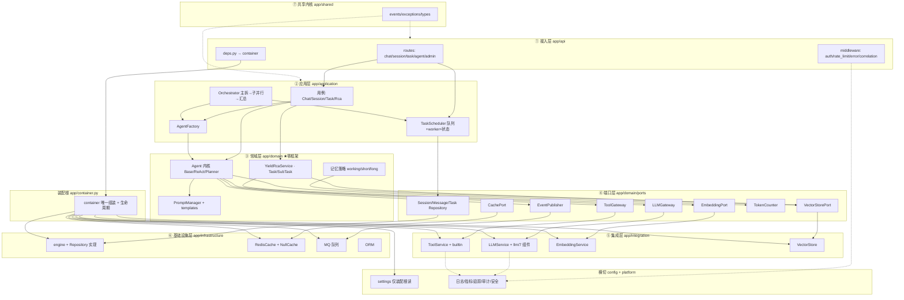

# 架构设计文档

> **更新日期**：2026-08-15
> **文档定位**：系统整体架构的**工业级目标蓝图** + 现状对照 + 演进路线。以目标架构为主线；现状耦合作为对照依据；演进路径标注「已实现 / 进行中 / 待规划」。模块级细节见各模块说明文档（见文末「相关文档」）。
> **状态徽标**：✅ 已实现 ｜ 🔶 进行中 ｜ ⬜ 待规划

---

## 📋 目录

- [系统总览](#系统总览)
  - [一句话架构](#一句话架构)
  - [现状、目标与演进](#现状目标与演进)
  - [两张总图](#两张总图)
- [目标分层架构](#目标分层架构)
  - [分层总图](#分层总图)
  - [各层实现目标](#各层实现目标)
    - [接入层](#接入层)
    - [应用层](#应用层)
    - [领域层](#领域层)
    - [端口层](#端口层)
    - [集成层](#集成层)
    - [基础设施层](#基础设施层)
    - [共享内核](#共享内核)
    - [横切与装配根](#横切与装配根)
  - [目标核心链路](#目标核心链路)
- [依赖方向原则](#依赖方向原则)
  - [单向依赖规则](#单向依赖规则)
  - [目标依赖关系图](#目标依赖关系图)
  - [依赖倒置：端口与适配器](#依赖倒置端口与适配器)
  - [零外部框架依赖层](#零外部框架依赖层)
  - [装配根](#装配根)
- [现状耦合与差距](#现状耦合与差距)
  - [现状分层](#现状分层)
  - [耦合点状态清单](#耦合点状态清单)
- [演进路径](#演进路径)
  - [Phase A 基础设施落地](#phase-a-基础设施落地)
  - [Phase B 解耦改造](#phase-b-解耦改造)
  - [Phase C 应用与编排层](#phase-c-应用与编排层)
  - [Phase D 可观测性与业务域](#phase-d-可观测性与业务域)
  - [阶段依赖与验收](#阶段依赖与验收)
- [相关文档](#相关文档)

---

## 系统总览

### 一句话架构

FastAPI 异步受理用户目标 → 应用/编排层调度与拆分 → 领域层 Agent 内核推理（ReAct 循环）→ 集成层调用 LLM 网关与工具执行 → 基础设施层持久化与缓存 → 汇总输出带**证据链**的根因报告。产品方向为**多 Agent 任务执行引擎 + 半导体良率异常根因分析（Yield RCA）**。

### 现状、目标与演进

| 维度 | 现状（2026-08-15） | 目标（工业级） | 演进 |
| --- | --- | --- | --- |
| 分层 | 7 层 + 装配根已落地（domain/integration/application/infrastructure/shared） | 7 层 + 2 横切 + 装配根（Clean Architecture / Hexagonal） | Phase C-D |
| 依赖方向 | ✅ 已切断：domain 依赖 ports，integration 实现端口 | 单向向内 + 依赖倒置（Port / Adapter） | —（已完成） |
| 配置 | ✅ 已收敛：仅 container 读取（register_config 注入） | 仅装配根读取，各模块 `register_config` 注入 | —（已完成） |
| 装配 | ✅ `container.py`（Container）唯一组装 | `container.py` 唯一组装 | —（已完成） |
| 数据访问 | `SessionManager` 三合一（待拆分） | Repository + CachePort 分层 | Phase A |
| 编排 | 单 Agent ReAct + 并发闸门 | 任务队列 / worker 池 / 多 Agent 主从编排 | Phase C |
| 可观测 | 仅结构化日志 | 日志 + 指标 + 追踪 + 审计三件套 | Phase D |

### 两张总图

- **[分层架构图](#分层总图)**（ASCII，详细到模块）——回答「系统由哪些层、哪些模块组成」
- **[目标依赖关系图](#目标依赖关系图)**（Mermaid）——回答「各层各模块之间如何依赖」

---

## 目标分层架构

### 分层总图

```text
┌───────────────────────────────────────────────────────────────────────────────┐
│              AGENT-FORGE 目标架构（工业级 · 清洁 / 六边形）                       │
│          多 Agent 任务执行引擎 + 半导体良率根因分析（Yield RCA）                   │
└───────────────────────────────────────────────────────────────────────────────┘

┌───────────────────────────────────────────────────────────────────────────────┐
│ ① 接入层 Interface · app/api/                ⚠ 依赖方向：▼ 调用应用层用例        │
│  ┌─────────────────┬───────────────────┬───────────────────────────────────┐   │
│  │ routes 路由      │ middleware 中间件  │ deps.py 解析器                     │   │
│  │ chat · session  │ auth 鉴权 (JWT)   │ Depends → container（薄）          │   │
│  │ task · agent    │ rate_limit 限流   │ schemas/ Pydantic DTO             │   │
│  │ admin           │ error_handler     │ SSE 流适配 · WS                    │   │
│  │                 │ correlation 追踪   │                                   │   │
│  └─────────────────┴───────────────────┴───────────────────────────────────┘   │
└───────────────────────────────────────────────────────────────────────────────┘
                                  │  调用用例（Use Case）
                                  ▼
┌───────────────────────────────────────────────────────────────────────────────┐
│ ② 应用 / 编排层 Application · app/application/                                 │
│  ┌────────────────┬───────────────────┬─────────────────┬──────────────────┐   │
│  │ 用例服务        │ 任务调度枢纽        │ 多 Agent 编排     │ 业务用例          │   │
│  │ ChatUseCase    │ TaskScheduler     │ Orchestrator    │ RcaUseCase       │   │
│  │ SessionUseCase │ TaskQueue 优先级   │ 主拆→子并行→汇总  │ (Yield RCA)      │   │
│  │ TaskUseCase    │ WorkerPool 状态机  │ AgentFactory    │ 证据链编排        │   │
│  └────────────────┴───────────────────┴─────────────────┴──────────────────┘   │
└───────────────────────────────────────────────────────────────────────────────┘
                                  │  依赖领域模型 + 端口
                                  ▼
┌───────────────────────────────────────────────────────────────────────────────┐
│ ③ 领域层 Domain · app/domain/   ★ 零外部框架依赖 · 禁止 import services         │
│  ┌───────────────┬───────────────────┬──────────────────┬──────────────────┐   │
│  │ Agent 推理内核 │ 记忆策略           │ 提示词            │ 领域服务 / 模型    │   │
│  │ BaseAgent     │ working           │ PromptManager   │ YieldRcaService  │   │
│  │ ReActAgent    │ short_term        │ templates       │ EvidenceChain    │   │
│  │ PlannerAgent  │ long_term         │ (system/tools/  │ Task / SubTask / │   │
│  │ reasoning 策略 │ (纯策略接口)       │  planning)      │ TaskState 模型    │   │
│  │ CoT/Reflection│                   │                  │ AgentContext/    │   │
│  └───────────────┴───────────────────┴──────────────────┴──────────────────┘   │
└───────────────────────────────────────────────────────────────────────────────┘
                                  │  定义并依赖端口（依赖倒置）
                                  ▼
┌───────────────────────────────────────────────────────────────────────────────┐
│ ④ 端口层 Ports · app/domain/ports/   —— 领域拥有的抽象协议（typing.Protocol）    │
│  LLMGateway │ ToolGateway │ TokenCounter │ Session/Message/TaskRepository     │
│  CachePort │ VectorStorePort │ EmbeddingPort │ EventPublisher │ IdGenerator  │
└───────────────────────────────────────────────────────────────────────────────┘
                     ▲ 实现（Adapter，向端口注入）
      ┌──────────────┴────────────────────────────┐
      ▼                                            ▼
┌───────────────────────────────┐      ┌───────────────────────────────────────┐
│ ⑤ 能力 / 集成层 Capability     │      │ ⑥ 基础设施层 Infrastructure            │
│   app/integration/             │      │   app/infrastructure/（由空转实）       │
│  LLM 网关：LLMService +        │      │  db/engine.py + db/repos/              │
│   llm/ 7 组件（实现 LLMGateway）│      │   （SqlSession/Message/Task Repo）     │
│  工具：ToolService（拆分 Facade）│      │  redis/client + redis/cache.py        │
│   + builtin 5 工具 + RCA 工具   │      │   （RedisCache + NullCache 真降级）    │
│  嵌入：EmbeddingService         │      │  mq/ 队列 · store/ 存储 · http/       │
│  向量：VectorStore Adapter      │      │  models/database/（ORM 归位）         │
└───────────────────────────────┘      └───────────────────────────────────────┘
                                  │
                                  ▼
┌───────────────────────────────────────────────────────────────────────────────┐
│ ⑦ 共享内核 Shared Kernel · app/shared/   —— 无依赖公共类型，被所有层引用         │
│  events.py：事件类型 + 领域事件 + build_*_event(SSE) + EventPublisher          │
│  exceptions.py：异常体系 → 业务错误码     types.py：通用类型 / 标识             │
└───────────────────────────────────────────────────────────────────────────────┘

┌ 横切关注点（注入方式使用，禁止散落 import 单例）────────────────────────────────┐
│ 配置 app/config：settings 仅装配根读取；各模块经 register_config 注入            │
│ 可观测/安全 app/platform：日志 · Prometheus 指标 · OTel 追踪 · 审计 · JWT        │
└────────────────────────────────────────────────────────────────────────────────┘

装配根 Composition Root：app/container.py —— 唯一读 settings，组装 ④⑤⑥ 并注入 ③
```

### 各层实现目标

> 全系统目标蓝图，按架构层组织。每层列出目标模块、职责、现状与目标状态；演进阶段见 [演进路径](#演进路径)。状态徽标：✅ 已实现 ｜ 🔶 进行中 ｜ ⬜ 待规划。

#### 接入层

| 目标模块 | 职责 | 现状 | 目标状态 | 演进阶段 |
| --- | --- | --- | --- | --- |
| chat / session 路由 | 交互式聊天 SSE、会话 CRUD | ✅ 已实现 | ✅ | — |
| task / agent / admin 路由 | 异步任务提交/查询/进度、Agent 管理 | ⬜ 空文件 | 🔶 | Phase C |
| 中间件（auth / rate_limit / error_handler / correlation） | 鉴权、限流、错误码映射、关联 ID | ⬜ 空文件 | 🔶 | Phase D |
| deps.py 薄解析 + schemas DTO | Depends → container；请求/响应模型 | ✅ `app/api/deps.py` | ✅ | — |

#### 应用层

| 目标模块 | 职责 | 现状 | 目标状态 | 演进阶段 |
| --- | --- | --- | --- | --- |
| 用例服务（Chat / Session / Task / Rca） | 路由内联编排上移为用例 | 🔶 内联于路由 | 🔶 | Phase C |
| TaskScheduler（队列 / 优先级 / 背压 / worker / 状态） | 任务调度枢纽 | 🔶 仅并发闸门 | 🔶 | Phase C |
| Orchestrator + AgentFactory | 多 Agent 主拆 → 子并行 → 汇总 | ⬜ 未实现 | 🔶 | Phase C |
| 定时任务 | 周期任务编排 | ⬜ 未实现 | 🔶 | Phase D |

#### 领域层

| 目标模块 | 职责 | 现状 | 目标状态 | 演进阶段 |
| --- | --- | --- | --- | --- |
| Agent 内核（BaseAgent / ReActAgent） | ReAct 循环推理、工具调用 | ✅ 已实现 | ✅ | — |
| PlannerAgent + reasoning（CoT / Reflection） | 任务拆分、推理策略 | ⬜ 空文件 | 🔶 | Phase C |
| 记忆策略（working / short_term / long_term） | 短期 / 长期记忆 | ⬜ 空文件 | 🔶 | Phase C/D |
| PromptManager + planning 模板 | 提示词管理与接线 | ✅ 已实现（零引用） | 🔶 | Phase C |
| YieldRcaService + EvidenceChain | 良率 RCA 领域服务、证据链 | ⬜ 未实现 | 🔶 | Phase D |
| Task / SubTask / TaskState 模型 | 任务领域模型与状态机 | ⬜ 未实现 | 🔶 | Phase C |

#### 端口层

| 目标模块 | 职责 | 现状 | 目标状态 | 演进阶段 |
| --- | --- | --- | --- | --- |
| LLMGateway / ToolGateway / TokenCounter | 领域依赖的 LLM / 工具 / token 抽象 | ✅ LLMGateway/ToolGateway + StreamResult/ToolResult 已实现（TokenCounter 待规划） | ✅ | — |
| Session / Message / Task Repository | 持久化抽象 | ⬜ 未实现 | 🔶 | Phase A |
| CachePort / VectorStorePort / EmbeddingPort | 缓存 / 向量 / 嵌入抽象 | ⬜ 未实现 | 🔶 | Phase A/B |
| EventPublisher / IdGenerator | 事件发布、ID 生成 | ⬜ 未实现 | 🔶 | Phase B |

#### 集成层

| 目标模块 | 职责 | 现状 | 目标状态 | 演进阶段 |
| --- | --- | --- | --- | --- |
| LLMService + llm/ 7 组件 | LLM 网关（实现 LLMGateway） | ✅ 已实现 | ✅ | 归位 integration |
| 可靠性链（重试 / 熔断 / 限流 / 整流 / 结构化降级） | 外部调用可靠性 | ✅ 已实现（llm/ 子包） | ✅ | — |
| ToolService（拆分 Facade）+ builtin 5 工具 | 工具执行（实现 ToolGateway） | ✅ 已拆分（Registry/Executor/Stats/Hooks/Assembler） | ✅ | — |
| RCA 工具（良率 / 告警 / FDC / wafer / 历史检索） | 良率分析工具链 | ⬜ 未实现 | 🔶 | Phase C/D |
| EmbeddingService（实现 EmbeddingPort） | 文本向量化 | ✅ 已实现（孤儿） | 🔶 | Phase D |
| VectorStore adapter（Milvus） | 向量库检索 | ⬜ 空文件 | 🔶 | Phase D |

#### 基础设施层

| 目标模块 | 职责 | 现状 | 目标状态 | 演进阶段 |
| --- | --- | --- | --- | --- |
| db/engine.py + Repository 实现 | 连接池、SQLAlchemy Repository | ⬜ 空文件（container 直管） | 🔶 | Phase A |
| redis/client + RedisCache + NullCache | 缓存实现（含真降级） | ⬜ 空文件 | 🔶 | Phase A |
| mq/（asyncio.Queue / Redis Streams） | 任务队列、事件总线实现 | ⬜ 空文件 | 🔶 | Phase C |
| store / http | 对象存储、HTTP 客户端封装 | ⬜ 空文件 | 🔶 | Phase D |
| ORM（models/database/） | Session / Message / Task 模型 | 🔶 Session/Message 已实现 | 🔶 | Phase A |

#### 共享内核

| 目标模块 | 职责 | 现状 | 目标状态 | 演进阶段 |
| --- | --- | --- | --- | --- |
| events.py（迁移 + 拆分） | 事件类型 / 领域事件 / SSE 序列化 / EventPublisher | ✅ 已迁 `app/shared/` | ✅ | — |
| exceptions.py（异常体系 → 错误码） | 统一异常与错误码 | ⬜ `utils/exceptions` 空 | 🔶 | Phase B |
| types.py | 通用类型 / 标识 | ⬜ 未实现 | 🔶 | Phase B |

#### 横切与装配根

| 目标模块 | 职责 | 现状 | 目标状态 | 演进阶段 |
| --- | --- | --- | --- | --- |
| 配置：settings + register_config 注入 | 配置源，仅装配根读取 | ✅ 已收敛（container 唯一读，register_config 全面推广） | ✅ | — |
| 可观测：日志 / 指标 / 追踪 / 审计 | 可观测三件套 | 🔶 仅日志框架 | 🔶 | Phase D |
| 安全：鉴权 JWT / 密钥管理 | 认证授权、密钥托管 | ⬜ mock 鉴权 | 🔶 | Phase D |
| 装配根：container.py | 唯一读 settings + 组装 + 生命周期 | ✅ container.py（Container 类） | ✅ | — |

---

### 目标核心链路

#### 链路 1：交互式聊天（HTTP → SSE）

```text
POST /api/chat/send
  → deps.py 注入容器组件
  → ChatUseCase（用例编排）
      → SessionRepository 校验会话 + 存用户消息（CachePort 热缓存）
      → ContextManager 组装 messages（TokenCounter 计数/截断）
      → TaskScheduler 提交任务（优先级/并发闸门）
          → AgentFactory 创建 Agent（注入 LLMGateway/ToolGateway）
          → BaseAgent.run()（ReAct 循环）
              → LLMGateway.async_generate（流式 + 重试/熔断/限流/整流）
              → ToolGateway.execute（工具级信号量）
  → SSE 事件流 → 存 assistant 消息
```

#### 链路 2：多 Agent 主从并行（批量任务）

```text
POST /api/tasks/submit
  → TaskUseCase 入队（优先级 + 有界背压）
  → Worker 取任务 → TaskState: pending → running
  → Orchestrator 编排：
      主 Agent 拆分（planning prompt）→ SubTask[1..n]
      → 并行子 Agent（受并发信号量约束）→ 各自 ReAct 循环
  → 主 Agent 汇总 → TaskState: completed → 结果带证据链
```

#### 链路 3：Yield RCA 证据链（产品场景）

```text
RcaUseCase 受理良率异常报告
  → 主 Agent 拆分排查子任务（查批次良率 / 设备告警 / FDC 参数 / wafer map / 历史案例）
  → 子 Agent 并行执行（工具链逐层推理）
  → VectorStorePort 检索历史 RCA（RAG）+ EmbeddingPort
  → 汇总：每个结论附数据来源（证据链）+ 置信度分级 + 显式放弃
  → 人机协同：提议根因与下一步，工程师验证
```

---

## 依赖方向原则

### 单向依赖规则

```text
接入层 → 应用层 → 领域层  ←（依赖倒置） 集成层 / 基础设施层 实现领域端口
                                                    ↗
所有层 → 共享内核（无反向依赖）                    领域层 只依赖 端口层 + 共享内核
横切关注点：通过注入使用，禁止模块内 import 全局单例
```

1. **依赖收敛指向内侧**：`api → application → domain`；`domain` 只依赖 `domain/ports` 与 `shared`；`integration` / `infrastructure` 是 `ports` 的实现方。
2. **禁止越层**：接入层不得触碰领域内部细节或直接 new Agent；领域层不得 import 服务层 / 基础设施 / 配置。
3. **配置与可观测经注入使用**：不散落 `import settings`、`import logger`。

### 目标依赖关系图



> 语义：依赖一律向内（`→`）；领域层只出箭头到端口层；端口层由集成层 / 基础设施层实现；共享内核被各层引用但无反向依赖；装配根 `container` 是唯一入度中心。

---

### 依赖倒置：端口与适配器

领域层定义抽象协议（`typing.Protocol`），集成层 / 基础设施层实现之，装配根在启动时注入：

```python
# app/domain/ports/llm_gateway.py —— 领域拥有的端口
from typing import Protocol

class LLMGateway(Protocol):
    async def async_generate(self, messages, tools=None, model_key="main", **kwargs): ...
    async def generate(self, messages, tools=None, model_key="fast", **kwargs): ...

# app/integration/llm/llm_service.py —— 集成层实现
class LLMService:  # implements LLMGateway
    async def async_generate(self, messages, tools=None, model_key="main", **kwargs): ...

# app/container.py —— 装配根注入
def build_agent(llm: LLMGateway, tools: ToolGateway) -> BaseAgent:
    return ReActAgent(llm=llm, tools=tools)   # BaseAgent 依赖抽象，不依赖具体类
```

参照范式：现有 `llm/` 子包的 `register_config()` 配置注入（零 settings 依赖）、`ContextManager` 的构造注入。

### 零外部框架依赖层

| 层 | 允许依赖 | 禁止依赖 |
| --- | --- | --- |
| 领域层 | 标准库、`domain/ports`、`shared` | FastAPI / SQLAlchemy / OpenAI SDK / redis / tiktoken / pydantic-settings |
| 端口层 | 标准库（`typing.Protocol`） | 一切外部框架 |
| 共享内核 | 标准库（可选 Pydantic dataclass） | 业务依赖 |

tiktoken 计数经 `TokenCounter` 端口在集成层实现；ORM / Redis 经 Repository / CachePort 在基础设施层实现。

### 装配根

`app/container.py` 是唯一例外：

- **唯一读 settings**：各模块经 `register_config()` / 构造注入获得配置，不直接 import
- **唯一组装**：创建基础设施 → 注册配置 → 实例化适配器 → 组装用例 / Agent → 生命周期（initialize / shutdown）
- `main.py` 只做 lifespan 接线；`deps.py` 只做 `Depends` → container 的薄解析

---

## 现状耦合与差距

> 以下为 2026-08-15 代码现状。C3 / C4 / C5 / C6 / C8 已通过系列重构解决；C1 / C2 / C7 部分 / C9 仍待处理。

### 现状分层

```text
接入层 app/api              chat/session ✅；deps.py ✅；task/agent/admin + 中间件 ⬜
应用层 app/application      session/context/task ✅；TaskScheduler 队列/编排 ⬜
领域层 app/domain           Agent 内核 ✅（依赖 ports）；memory/planner ⬜
集成层 app/integration      LLM ✅；ToolService（已拆分）✅；Embedding 孤儿
基础设施层 app/infrastructure  models/database ✅；db/redis 仍由 container 管 ⬜
共享内核 app/shared         events ✅
装配根 app/container        Container 唯一组装 ✅
```

### 耦合点状态清单

| # | 耦合问题 | 严重度 | 解法 | 阶段 | 状态 |
| --- | --- | --- | --- | --- | --- |
| C1 | 基础设施层形同虚设，DB/Redis 由装配根直接管理 | 🔴 | 新建 `container.py` 装配根；`infrastructure/db/engine.py` + `redis/client.py` 承载连接创建 | A | ❌ 待做 |
| C2 | SessionManager 三合一（业务 + 缓存 + SQL） | 🔴 | 拆 `SessionRepository` / `MessageRepository` 与 `CachePort`（RedisCache / NullCache）；SessionManager 只留业务 | A | ❌ 待做 |
| C3 | 核心层依赖服务层具体类 | 🔴 | 定义 `LLMGateway` / `ToolGateway` 端口；`BaseAgent` 依赖抽象；`StreamResult` 迁 ports | B | ✅ 已解决 |
| C4 | core ⇄ services 双向耦合 | 🟠 | `events.py` 迁 `app/shared/`；core 与 services 不再互引 | B | ✅ 已解决 |
| C5 | settings 单例被 10 处直接 import | 🟠 | 推广 `register_config` 注入；container 唯一读 settings | B | ✅ 已解决 |
| C6 | events.py 跨三层共享（位置不当） | 🟠 | events 按职责拆分入 shared | B | ✅ 已解决 |
| C7 | DI 不统一 | 🟡 | container 统一装配；deps 薄解析；`AgentFactory` 创建 Agent；AgentContext 注入 | B/C | 🔶 部分 |
| C8 | ToolService God Object | 🟡 | 拆 `Registry` / `Executor` / `Stats` / `Hooks` / `Assembler`，Facade | B | ✅ 已解决 |
| C9 | 半成品 / 死代码 | 🟡 | PromptManager 接 PlannerAgent；StructuredOutput 供 RCA；memory/vector_store 实现；Embedding 接 RAG | C/D | ❌ 待做 |
| C10 | 构造注入规范范例 | ✅ | 升级为全局 DI 约定（构造注入 + 装配根 + 端口抽象） | B | ✅ 已确立 |

**其他隐患**：Redis 假降级（`redis=None` 时 SessionManager 直接 AttributeError）；鉴权为 mock；CORS 组合不安全。

## 演进路径

> 架构文档为**设计蓝图**，各阶段标注「已实现 / 进行中 / 待规划」，状态随 HANDOFF、service.md 同步更新。

### Phase A 基础设施落地

目标：C1、C2 主体、假降级。

- `infrastructure/db/engine.py` + `redis/client.py`：engine/factory 从 container 迁出
- `domain/ports/repositories.py` + `cache.py`：Repository / CachePort 协议
- `infrastructure/db/repos/`：SqlAlchemy Repository 实现
- `infrastructure/redis/cache.py`：RedisCache + **NullCache**（修假降级）+ key 常量集中
- `container.py`：接管 container 装配根职责
- `SessionManager` 重构：只留业务，注入 Repos + CachePort

架构达成：装配根与基础设施工厂分离；Repository 层落地；Redis 真降级。
当前进度：`container.py` 已接管装配根（✅）；db/redis 迁移、Repository 层、SessionManager 拆分待做（🔶 进行中）。

### Phase B 解耦改造

目标：C3、C4、C5、C6、C7、C8。

- `shared/events.py`：events 迁入 + 拆分
- `domain/ports/llm_gateway.py` + `tool_gateway.py` + `token_counter.py`（StreamResult 迁入）
- core/agent 构造签名改抽象（`BaseAgent(llm: LLMGateway, tools: ToolGateway)`）
- LLMService / ToolService 实现端口；配置注入推广（AgentContext / 内置工具 / TaskService / LLMService Facade）
- ToolService 拆分（Registry/Executor/Stats/Hooks/Assembler）；dependencies.py 薄化；EmbeddingService 补 getter

架构达成：core ⇄ services 双向耦合切断（C3 / C4 ✅）；settings 收敛到 container（C5 ✅）；events 迁 shared（C6 ✅）；ToolService 拆分（C8 ✅）；DI 统一（C7 部分）；C10 范例升级为全局规范。`🔶 大部分完成（TokenCounter 端口 / exceptions / types / Embedding getter 待做）`

### Phase C 应用与编排层

目标：C9 部分 + 产品闭环 1-3。

- `application/chat/chat_use_case.py`：路由编排上移
- `application/task/`：TaskQueue（优先级 + 背压）/ WorkerPool / TaskState / TaskScheduler（扩展原 TaskService）
- `application/orchestration/orchestrator.py`：主拆 → 子并行 → 汇总
- `domain/agent/planner.py` 转实（PlannerAgent）+ PromptManager 接线（planning prompt）
- `application/factories/agent_factory.py`；`api/routes/task.py` + `agent.py`（提交/查询/进度 SSE）

架构达成：异步任务受理闭环（`POST /tasks` → worker → `GET /tasks/{id}` → SSE 进度）；多 Agent 主从并行编排。`⬜ 待规划`

### Phase D 可观测性与业务域

目标：C9 剩余 + Yield RCA 产品。

- `platform/observability/`：metrics（Prometheus）/ tracing（OTel）/ audit / 日志迁入
- 中间件实现：auth（JWT）/ rate_limit / error_handler（错误码）/ correlation
- `domain/yield_rca/`：实体 + RcaService；`application/yield_rca/rca_use_case.py`；5 个 RCA 工具
- embedding / vector_store / memory 接线（RAG：search_historical_rca）；StructuredOutput 供报告结构化
- MemoryService 实现（短期注入 ContextManager + 长期向量 RAG）

架构达成：全链路可观测三件套；鉴权 / 限流 / 错误码真实；Yield RCA 带证据链根因报告闭环；C9 清零。`⬜ 待规划`

### 阶段依赖与验收

```text
Phase A ──→ Phase B ──→ Phase C ──→ Phase D
端口 / 装配根是解耦前提；解耦后编排才不踩双向环；编排稳定后再上可观测与业务域
```

每阶段验收 = 214 现有测试保持通过 + 新增该阶段关键路径测试；文档状态徽标同步（HANDOFF / architecture / service.md 同源）。

---

## 相关文档

- [HANDOFF](HANDOFF.md)（项目交接，顶层计划/进度）
- [product](product.md)（产品方向）
- [服务层说明](application_doc/README.md)（服务层模块 + 实现目标 — 对标工业级）
- [agent 模块](domain_doc/agent_doc/agent.md)
- [api 模块](api_doc/api.md)
- [config 模块](config_doc/config.md)
- [logging 模块](utils_doc/logging.md)（全局日志框架）
- [error_handling 模块](utils_doc/error_handling.md)（异常处理与传播约定）
- [class-design 模块](utils_doc/class-design.md)（类的类型体系与实例形态）
- [LLM 层](integration_doc/llm_doc/llm.md)
- [task 模块](application_doc/task_doc/task.md)
- [tool 模块](integration_doc/tools_doc/tools.md)
- [部署](deployment.md)
