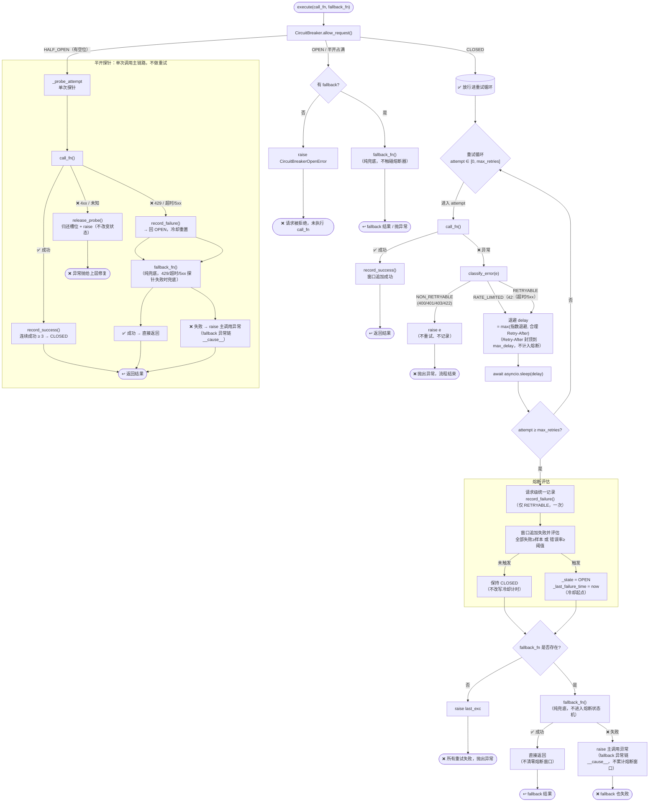

# RetryHandler 设计文档

> **模块**：`app/integration/llm/retry.py`
> **更新日期**：2026-08-16
> **职责**：LLM API 调用的重试、熔断与降级
> **状态**：✅ 已实现

---

## 📋 目录

- [RetryHandler 设计文档](#retryhandler-设计文档)
  - [📋 目录](#-目录)
  - [设计目标](#设计目标)
  - [核心概念解释](#核心概念解释)
    - [指数退避（Exponential Backoff）](#指数退避exponential-backoff)
    - [随机抖动（Jitter）](#随机抖动jitter)
    - [熔断器（Circuit Breaker）](#熔断器circuit-breaker)
    - [半开探针（Half-Open Probe）](#半开探针half-open-probe)
    - [降级 / Fallback](#降级--fallback)
  - [架构总览](#架构总览)
  - [组件详解](#组件详解)
    - [RetryConfig — 重试配置](#retryconfig--重试配置)
    - [CircuitBreakerConfig — 熔断配置](#circuitbreakerconfig--熔断配置)
    - [CircuitBreaker — 熔断器](#circuitbreaker--熔断器)
    - [RetryHandler — 重试执行器](#retryhandler--重试执行器)
    - [RetryHandlerManager — 重试执行器管理](#retryhandlermanager--重试执行器管理)
    - [classify\_error — 错误分类](#classify_error--错误分类)
  - [执行流程](#执行流程)
    - [完整流程图](#完整流程图)
    - [场景推演：一次完整的"熔断-恢复"周期](#场景推演一次完整的熔断-恢复周期)
  - [对外接口](#对外接口)
  - [边界情况](#边界情况)
  - [配置项清单](#配置项清单)
  - [测试状态](#测试状态)
  - [设计决策](#设计决策)
  - [问题记录](#问题记录)

---

## 设计目标

1. **自动恢复**：临时故障（超时、5xx）自动重试，无需上层感知
2. **自适应保护**：连续故障时熔断，防止对已宕机的下游发无用请求
3. **优雅降级**：主模型不可用时自动切换备用模型，保证服务不中断
4. **拒绝羊群效应**：指数退避 + 随机抖动，避免多并发同时重试

---

## 核心概念解释

### 指数退避（Exponential Backoff）

每次重试的等待时间按指数增长：

```text
delay = base_delay × 2^attempt
```

- attempt=0 → 1s，attempt=1 → 2s，attempt=2 → 4s，attempt=3 → 8s
- 上限由 `max_delay` 控制（默认 30s）
- **Retry-After 叠加**：429 时若服务端返回 `Retry-After`，在合理区间 `0 < retry_after ≤ max_delay` 内取 `max(delay, retry_after)`（尊重服务端建议）；超出 `max_delay` 忽略并回退指数退避——`retry-after: 3600` 这类异常/恶意值不会让请求挂死一小时（对齐 OpenAI SDK 的「合理区间」判断，用 `max_delay` 而非魔法数 60）
- **Retry-After 解析**（`_extract_retry_after`）：从限流异常 `headers` 读取 `retry-after`（兼容 `Retry-After` 大小写两种）；`float()` 解析失败（HTTP-date 形式如 `Wed, 21 Oct 2015 07:28:00 GMT`）返回 `None`，回退指数退避

**直觉**：第一次失败可能是瞬时的，短等即可；连续失败说明问题更严重，给对方更长的恢复时间。

### 随机抖动（Jitter）

在退避延迟上叠加随机值：

```text
delay = random.uniform(0, base_delay × 2^attempt)
```

**为什么需要**：没有抖动的退避中，多个同时失败的请求会在完全相同的时刻重试（t=1s, t=2s, t=4s...），制造周期性的流量尖峰——**羊群效应**（thundering herd）。抖动将重试时间打散，降低对下游的瞬时压力。

### 熔断器（Circuit Breaker）

三种状态：

```text
CLOSED（正常）──窗口错误率≥阈值 或 全部失败≥样本 ──→ OPEN（熔断）
    ↑                                                    │
    │                                                    │ recovery_timeout 超时
    │                                                    ▼
    │                                               HALF_OPEN（半开/探测）
    └── 连续 N 次探针都成功 ────────────────────┘
           探针失败（429/超时/5xx）────────────→ OPEN（继续熔断）
```

- **CLOSED**：正常状态，所有请求放行。熔断判定基于**滑动时间窗口**内的错误率（参考 Hystrix）：窗口内总请求达最小请求量且错误率 ≥ 阈值 → 熔断；或窗口内**全部失败**且失败数 ≥ 样本下限（低流量纯失败保护）→ 熔断
- **OPEN**：熔断状态，请求快速拒绝（有 fallback 则走纯兜底，无则抛 `CircuitBreakerOpenError`），不调用 API
- **HALF_OPEN**：恢复探测状态，放行 `half_open_max_requests` 个探针请求，要求**全部连续成功**才恢复；任一失败（429/超时/5xx）则回到 OPEN（4xx/未知不改变状态，归还槽位）

### 半开探针（Half-Open Probe）

熔断后，`recovery_timeout` 超时进入半开状态，放行 `half_open_max_requests` 个探针请求验证下游是否恢复。**每个探针都是单次调用**（走 `_probe_attempt`，不进入重试循环）。

探针结果分类（半开探针语义完整记录见 [问题 LLM-022](../../../issues/integration/llm/2026-08-05-half-open-probe-semantics.md)）：

| 探针结果 | 分类 | 处理 |
| --- | --- | --- |
| 成功（2xx） | 成功 | `record_success()`，累计连续成功，达阈值才关闭 |
| 429 | 失败 | `record_failure()` 回 OPEN + 冷却重置（下游仍过载，停止探测） |
| 超时 / 5xx | 失败 | `record_failure()` 回 OPEN + 冷却重置（下游故障证据） |
| 4xx / 未知 | 无效探测 | **不改变状态 + `release_probe()` 归还槽位 + `raise`**（客户端问题，不算健康探测，等待正常请求探测真实状态） |
| 协程被取消 / 自定义 `BaseException` | 中断 | `CancelledError` → `record_failure()` 回 OPEN + 立即传播（不尝试 fallback）；其余 `BaseException`（SystemExit 等）→ **finally 兜底归还槽位**（槽位永不泄漏不变量，见 [LLM-022](../../../issues/integration/llm/2026-08-05-half-open-probe-semantics.md)） |

**探针不重试 + 探针失败仍降级**（决策依据见 [LLM-022](../../../issues/integration/llm/2026-08-05-half-open-probe-semantics.md)，对照 Hystrix / Resilience4j 工业实践）：

两个问题必须分开看——**探针是否需要重试** 与 **探针失败是否需要降级**：

1. **探针不重试**（共识）：Hystrix 源码注释「only the first request after sleep window should execute」、Resilience4j 半开放行 `permittedNumberOfCallsInHalfOpenState` 个探针**直接打主服务**——探针的意义就是单次探测恢复，重试会让一次探测失败放大成多次调用、干扰恢复判断。
2. **探针失败仍降级**（fallback 是方法级包装，非熔断状态机一部分）：fallback 的触发条件是「主调用抛异常/超时」或「熔断器拒绝」**两个独立事件**——HALF_OPEN 探针失败 = 主调用抛异常，必然触发 fallback。用户请求不该因「系统正探测恢复」而收到裸异常，应拿到降级响应。Netflix Hystrix `getFallback()` 在请求被拒绝/失败/超时/短路时都执行。**探针的目的只是探测恢复，不代表这次用户请求该被牺牲**。

### 降级 / Fallback

主模型全部重试失败后，尝试备用模型：

```text
主模型 call_fn → 重试 N 次 → 全部失败
    → fallback_fn（备用模型）→ 成功 → 直接返回（不触碰熔断器）
    → fallback_fn 也失败 → 抛出主调用异常（fallback 异常链为 __cause__）
```

**关键约束：fallback 是纯兜底，其成败完全不进入熔断状态机**（不调用 `record_success`/`record_failure`）。熔断器只观察主链路（`call_fn`）的健康：备用链路通不能证明主链路恢复，备用链路故障也不代表主链路故障。

**fallback 也失败时**：最终抛出**主调用（call_fn）异常**，fallback 异常以 `__cause__` 链上保留——熔断窗口记录的是主链路状态，上层需按主异常判定语义（重试/降级/日志）；被 fallback 异常覆盖会导致上层拿到的异常类型与熔断器记录不一致。此约定对 CLOSED 重试路径与 HALF_OPEN 探针路径（`_probe_attempt`）一致；熔断 OPEN 的拒绝路径主调用未执行，fallback 异常直接抛。

---

## 架构总览

```text
            RetryHandlerManager（按 model_key 缓存共享）
                     │
                     ▼
                 RetryHandler
                     │
        ┌────────────┼───────────────┐
        ▼            ▼               ▼
  RetryConfig   CircuitBreaker   classify_error
        │            │               │
   max_retries  CircuitBreakerConfig 超时→RETRYABLE
   base_delay   │                   5xx→RETRYABLE
   max_delay    ├─ window_seconds    429→RATE_LIMITED
   use_jitter   ├─ error_threshold   4xx→NON_RETRYABLE
                ├─ request_volume_threshold
                ├─ all_failed_min
                ├─ recovery_timeout
                └─ half_open_max_requests
```

| 层 | 组件 | 职责 |
| --- | --- | --- |
| 管理 | `RetryHandlerManager` | 按 model_key 缓存共享 RetryHandler（熔断窗口跨请求积累） |
| 配置层 | `RetryConfig` | 重试参数（次数、退避、抖动） |
| 配置层 | `CircuitBreakerConfig` | 熔断参数（滑动窗口、错误率阈值、冷却、半开探针数） |
| 保护层 | `CircuitBreaker` | 熔断状态机（关闭/开启/半开），持有 `CircuitBreakerConfig` |
| 判定层 | `classify_error()` | 异常分类（可重试/致命/限流） |
| 编排层 | `RetryHandler` | 整合上述四者的主循环 |

---

## 组件详解

### RetryConfig — 重试配置

```python
@dataclass
class RetryConfig:
    max_retries: int = 2        # 最大重试次数（不含首次）
    base_delay: float = 1.0     # 退避基数（秒）
    max_delay: float = 30.0     # 退避上限（秒）
    use_jitter: bool = True     # 是否启用随机抖动
```

`max_retries=2` 时实际最多执行 3 次（首次 + 重试 2 次），与 `range(max_retries + 1)` 配合。

### CircuitBreakerConfig — 熔断配置

```python
@dataclass
class CircuitBreakerConfig:
    window_seconds: float = 10.0             # 滑动时间窗口长度（秒）
    error_threshold: float = 0.5             # 窗口内错误率熔断阈值（50%）
    request_volume_threshold: int = 20       # 窗口内最小请求量，不足则不做错误率评估
    all_failed_min: int = 3                  # 低流量纯失败保护：全部失败且达此样本量才熔断
    recovery_timeout: float = 30.0           # 熔断持续秒数后进入半开
    half_open_max_requests: int = 3          # 半开状态最大探针数
```

纯配置对象（默认值为合理硬编码），运行时由 `RetryHandlerManager.register_config(circuit_breaker_config=...)` 注入 settings 值；`CircuitBreaker` 只持有该对象并维护状态机，与 `RetryConfig` 一样遵循「配置与逻辑分离」的依赖注入模式。

### CircuitBreaker — 熔断器

```python
class CircuitBreaker:
    def __init__(self, config: CircuitBreakerConfig | None = None) -> None:
        self.config = config or CircuitBreakerConfig()
        self._state = CircuitState.CLOSED
        self._window: deque[tuple[float, bool]] = deque()
        self._last_failure_time = 0.0
        self._half_open_requests = 0
        self._consecutive_successes = 0
```

**关键方法**：

| 方法 | 触发时机 | 行为 |
| --- | --- | --- |
| `allow_request()` | 每次执行前 | CLOSED/探针→True；OPEN→False；半开耗尽→False |
| `record_success()` | 请求成功 | 窗口追加成功；HALF_OPEN 下累计连续成功，达探针阈值才关闭；**OPEN 下 no-op**（见下） |
| `record_failure()` | 请求失败 | 返回 `bool`；窗口追加失败并评估→OPEN；半开失败→OPEN 并清空成功；OPEN 下 no-op（见下） |
| `release_probe()` | 探针收到 NON_RETRYABLE | 归还探针槽位（`_half_open_requests` 减 1），状态不变；仅 HALF_OPEN 下有效 |
| `state`（property） | 随时 | 当前熔断状态（CLOSED / OPEN / HALF_OPEN） |
| `failure_count`（property） | 随时 | 窗口内当前失败请求数（先清理过期条目） |
| `reset()` | 手动 | 重置熔断器为 CLOSED，清空窗口与半开计数 |

**状态机细节**：

- `OPEN→HALF_OPEN` 切换时，当前请求作为第一个探针（`half_open_requests=1`），所以 `half_open_max_requests=3` 时共放行 3 个探针，第 4 个拒绝
- HALF_OPEN 下
  - **全部探针连续成功**（`_consecutive_successes ≥ half_open_max_requests`）：关闭熔断器
  - **429/超时/5xx（RETRYABLE）失败**：回 OPEN 并清空成功计数
  - **4xx/未知（NON_RETRYABLE）失败**：探针不改变状态，`release_probe()` 归还槽位（成功计数保留），等待正常请求探测真实状态
- CLOSED 下
  - `record_success()` 向滑动窗口追加成功记录，不直接改变状态——错误率随窗口滑动自然回落
  - `record_failure()` 向滑动窗口追加失败记录并评估：错误率达标（且请求量达门槛）或全部失败（且达样本下限）→ OPEN。返回 `True` 表示本次失败**触发了 OPEN**
- **OPEN 下 `record_success()`/`record_failure()` 均为 no-op**：不关闭熔断器、不追加窗口、不改写冷却计时
- **请求级粒度**：一次 `execute()` 的多次重试失败只调用一次 `record_failure()`（重试耗尽后统一记录），避免单请求的重试放大窗口统计。429 / 不可恢复错误不记录
- **`_last_failure_time` 记录冷却起点**：仅在进入 OPEN 时更新；探针失败（HALF_OPEN→OPEN，新一轮故障）时重置

**熔断器内部状态**（滑动窗口模型下没有"熔断计数"概念）：

| 状态项 | 字段 | 更新时机 | 清除时机 |
| --- | --- | --- | --- |
| 窗口请求记录 | `_window`（deque） | 每次请求级 `record_success()`/`record_failure()` 追加 `(ts, 成败)`；429 不计入 | 窗口滑动过期剔除；熔断关闭 → `clear()`；`reset()` |
| 半开探针计数 | `_half_open_requests` | `allow_request()` 放行探针时 +1 | `record_success()` → 0；`OPEN→HALF_OPEN` → 1；`release_probe()` → -1（归还槽位）；**探针失败回 OPEN → 0**（OPEN 不残留半开记账） |
| 连续成功计数 | `_consecutive_successes` | 半开下每次 `record_success()` +1 | 熔断关闭时 → 0；半开中失败 → 0 |

### RetryHandler — 重试执行器

```python
class RetryHandler:
    def __init__(self, config=None, circuit_breaker=None):
        self.config = config or RetryConfig()
        self.circuit_breaker = circuit_breaker or CircuitBreaker()

    async def execute(self, call_fn, fallback_fn=None) -> Any:
```

**设计要点**：

- `call_fn` / `fallback_fn` 都是 `Callable[[], Awaitable[Any]]`——零参数可等待函数，通过闭包捕获上下文
- **熔断检查在重试循环之前**
  - CLOSED 放行进重试循环；
  - HALF_OPEN 走单次探针（`_probe_attempt`）；
  - OPEN（或半开占满）拒绝主调用——有 fallback 走纯兜底，无则抛 `CircuitBreakerOpenError`
- **重试循环仅 CLOSED 下执行**，失败按类别处理
  - `NON_RETRYABLE` 直接抛出
  - `RATE_LIMITED`/`RETRYABLE` 退避重试（尊重 `Retry-After`）
- **请求级熔断记录**：重试耗尽后，
  - 本次请求**任一次尝试**出现过 `RETRYABLE` 失败（超时/5xx），统一调用一次 `cb.record_failure()`（可能触发 OPEN）
  - 纯 429 / 不可恢复错误不记录
  - 判定看"整个请求是否触及下游故障"，而非最后一次异常——混合 429 与超时的情况下，只要出现过超时就计入窗口
  - **混合失败（超时/5xx → 4xx）也补记**：若某次尝试是 `NON_RETRYABLE`（4xx）直接抛出，但**此前已出现过** `RETRYABLE` 失败，则在 `raise` 前先 `cb.record_failure()`——4xx 本身不计入（调用方问题），但前期的下游故障信号不能因最后一次是 4xx 而被抹掉
- **fallback 是纯兜底**：成功/失败都不触碰熔断器（熔断器只观察主链路 `call_fn` 的成败）

### RetryHandlerManager — 重试执行器管理

```python
class RetryHandlerManager:
    """按 model_key 提供共享 RetryHandler 实例（内含跨请求共享的 CircuitBreaker）。"""

    _instances: ClassVar[dict[str, RetryHandler]] = {}
    _config: ClassVar[RetryConfig | None] = None
    _circuit_breaker_config: ClassVar[CircuitBreakerConfig | None] = None

    @classmethod
    def register_config(cls, config=None, circuit_breaker_config=None) -> None:
        # 注入重试/熔断配置（Container 读 settings 后调用），并 reset 重建实例
    @classmethod
    def get(cls, model_key="main") -> RetryHandler:
        # 缓存命中 → 返回；未命中 → 懒创建 + 缓存（任意 key 均接受，不内置白名单）
    @classmethod
    def reset(cls) -> None:
        cls._instances.clear()
```

**为什么需要按 model_key 共享**（熔断窗口必须跨请求积累，完整生命周期见 [LLM-023](../../../issues/integration/llm/2026-08-07-circuit-breaker-lifecycle.md)）：

- **熔断窗口必须跨请求积累**：`CircuitBreaker` 的熔断判定（错误率 / 低流量纯失败保护）依赖**跨请求**的滑动窗口统计（`request_volume_threshold=20` 需要多个请求的样本）。若每次调用新建 `RetryHandler` + `CircuitBreaker`，窗口每次请求清空，`request_volume_threshold` 永远达不到 → **熔断实际永不触发**
- **按 model_key 隔离**：main / reasoning / fast 是不同模型/端点，应独立熔断（reasoning 故障不应熔断 fast）——与 `ClientManager`（按 key 缓存 client）、限流器 Manager（按 key 缓存桶）架构一致

**要点**：

- **共享实例**：同一 model_key 复用同一个 `RetryHandler`——熔断窗口跨请求记账，每次 new 等于没熔断
- **懒加载**：首次 `get()` 才创建，按 register_config 注入的配置构建（未注入时用硬编码默认值）
- **同步无竞态**：`get` 无 await，GIL 下天然原子，不会双实例
- **`reset()`**：配置变更或测试时清空缓存
- **配置注入**：子模块不直接依赖 settings——`Container.initialize()` 读 settings 调 `register_config()` 注入 `RetryConfig` + `CircuitBreakerConfig`；model_key 由外部传入，不内置白名单（对齐 ClientManager）
- **None 保留语义**：`register_config()` 的 `config` / `circuit_breaker_config` 传 `None` 时**不覆盖**现有配置（保持现有或默认），只对传入非 None 的配置项生效
- **配置全局一致**：当前重试/熔断配置为进程级全局（不按 model_key 差异化），仅熔断状态按 key 隔离；未来若需按模型差异化重试参数，在 `_build` 中按 key 读配置即可

### classify_error — 错误分类

```python
RETRYABLE       # 网络层（openai 封装 + 裸 httpx）、超时、5xx → 重试 + 计入熔断窗口
RATE_LIMITED    # 429 → 退避重试（尊重 Retry-After），不计入熔断窗口
NON_RETRYABLE   # 4xx、响应校验错误、token 截断、内容被过滤、未知异常 → 直接抛出，不重试
```

**分类规则**（白名单映射，**未知异常默认不可重试**）：

| 异常 / HTTP 状态 | 分类 | 处理 |
| --- | --- | --- |
| `TimeoutError` / `APITimeoutError` / `APIConnectionError` | RETRYABLE | 重试 + 计入熔断窗口 |
| 裸 `httpx` 网络异常（`ConnectError` / `ReadError` / `TimeoutException` 等） | RETRYABLE | 重试 + 计入熔断窗口 |
| 5xx（500-599，含 `InternalServerError`） | RETRYABLE | 重试 + 计入熔断窗口 |
| 429 / `RateLimitError` | RATE_LIMITED | 退避重试（尊重 Retry-After），**不计入熔断** |
| 4xx（400/401/403/404/405/409/413/422 等） | NON_RETRYABLE | 直接抛出不重试 |
| `APIResponseValidationError`（响应 schema 不匹配） | NON_RETRYABLE | 直接抛出不重试（重试无效） |
| `LengthFinishReasonError`（token 截断）/ `ContentFilterFinishReasonError`（内容被过滤） | NON_RETRYABLE | 直接抛出不重试（重试无效） |
| 未知异常（无 status_code、非已知类型） | **NON_RETRYABLE（默认兜底）** | 直接抛出不重试 |

> **坑：`InternalServerError` 没有硬编码 status_code** —— openai `InternalServerError` 继承 `APIStatusError` 但无字面量状态码（不像 `BadRequestError` 硬编码 400），`status_code` 是响应里的实际 5xx 值。**`classify_error` 不能依赖 `isinstance(exc, InternalServerError)` 判定**，必须走 `status_code` 分支（5xx → RETRYABLE）。

---

## 执行流程

### 完整流程图



### 场景推演：一次完整的"熔断-恢复"周期

以下推演使用默认配置：`max_retries=2`、`window_seconds=10`、`request_volume_threshold=20`、`error_threshold=0.5`、`all_failed_min=3`、`half_open_max_requests=3`。

```text
熔断器初始状态：CLOSED, _window=[]

─────────────────────────────────────────
请求 A（第 1 次请求）
─────────────────────────────────────────
  attempt=0 → call_fn() → ❌ 超时（RETRYABLE）
    退避 ~1s
  attempt=1 → call_fn() → ❌ 超时
    退避 ~2s
  attempt=2 → call_fn() → ❌ 超时
    重试耗尽 → 请求级统一记录：任一次尝试是超时（RETRYABLE）→ record_failure() 一次 → _window=[(T,✗)]
    评估：failures=1, total=1 → 全部失败但 < all_failed_min(3) → 不熔断
  → 无 fallback → raise last_exc

熔断器状态：CLOSED, _window=[✗]

─────────────────────────────────────────
请求 B（第 2 次请求）
─────────────────────────────────────────
  attempt=0 → call_fn() → ❌ 超时
    退避 ~1s
  attempt=1 → call_fn() → ❌ 超时
    退避 ~2s
  attempt=2 → call_fn() → ❌ 超时
    重试耗尽 → record_failure() → _window=[✗, ✗]
    评估：failures=2, total=2 → 全部失败但 < 3 → 不熔断
  → 无 fallback → raise last_exc

熔断器状态：CLOSED, _window=[✗, ✗]

─────────────────────────────────────────
请求 C（第 3 次请求）
─────────────────────────────────────────
  重试耗尽 → record_failure() → _window=[✗, ✗, ✗]
  评估：failures=3, total=3 → 全部失败且 ≥ all_failed_min(3) → 触发 OPEN！
  （低流量纯失败保护：请求量不足门槛也能熔断）
  ★ record_failure() 返回 True，熔断器切到 OPEN，_last_failure_time = T3
  → 无 fallback → raise last_exc

熔断器状态：OPEN, _last_failure_time=T3

─────────────────────────────────────────
请求 D ~ G（第 4~7 次请求，熔断持续中）
─────────────────────────────────────────
  每次 allow_request() → OPEN → False
  ← 全部抛出 CircuitBreakerOpenError
  ★ 不执行 call_fn，不消耗 API 配额
  ★ 窗口统计冻结（请求未到 record_failure 环节就被拒绝）

熔断器状态：OPEN（T3 开始计时）

─────────────────────────────────────────
T3 + 30s 后 → 请求 H（探针 #1）
─────────────────────────────────────────
  allow_request()：
    检测到 now - T3 ≥ recovery_timeout(30s)
    → _state = HALF_OPEN
    → _half_open_requests = 1
    → 放行（探针 #1）

  单次调用（探针不进入重试循环）→ call_fn() → ✅ 成功！
  record_success() → _consecutive_successes=1  ← 1/3
  ↩ 返回结果

熔断器状态：HALF_OPEN（还需 2 次成功）

─────────────────────────────────────────
请求 I（探针 #2）
─────────────────────────────────────────
  allow_request() → HALF_OPEN, 有空位 → 放行

  单次调用 → call_fn() → ✅ 成功！
  record_success() → _consecutive_successes=2  ← 2/3
  ↩ 返回结果

熔断器状态：HALF_OPEN（还需 1 次成功）

─────────────────────────────────────────
请求 J（探针 #3）
─────────────────────────────────────────
  allow_request() → HALF_OPEN, 有空位 → 放行

  单次调用 → call_fn() → ✅ 成功！
  record_success() → _consecutive_successes=3 ≥ 3
    → _state = CLOSED
    → _window.clear()，_half_open_requests / _consecutive_successes 清零
  ↩ 返回结果

熔断器已恢复：CLOSED，窗口清空

★ 若探针失败（429/超时/5xx）：`record_failure()` 回 OPEN、连续成功清零，
  等待下一轮冷却；4xx/未知探针不改变状态、归还槽位（见「核心概念·半开探针」）。
```

---

## 对外接口

| 方法 | 同步/异步 | 说明 |
| --- | --- | --- |
| `classify_error(exc) -> ErrorCategory` | 同步函数 | 异常分类（RETRYABLE / RATE_LIMITED / NON_RETRYABLE） |
| `RetryHandlerManager.get(model_key="main") -> RetryHandler` | 同步类方法 | 获取/懒创建共享 RetryHandler（含熔断器） |
| `RetryHandlerManager.register_config(config=None, circuit_breaker_config=None)` | 同步类方法 | 注入重试/熔断配置并重建实例（None 不覆盖） |
| `RetryHandler.execute(call_fn, fallback_fn=None) -> Any` | 异步方法 | 执行调用（重试 + 熔断 + fallback） |
| `CircuitBreaker.allow_request() -> bool` | 同步方法 | 判断是否允许请求通过 |
| `CircuitBreaker.record_success()` | 同步方法 | 记录主链路成功 |
| `CircuitBreaker.record_failure() -> bool` | 同步方法 | 记录主链路失败（可能触发 OPEN） |

---

## 边界情况

1. **熔断 OPEN 时的请求**：
   - 不执行 `call_fn`
   - 有 `fallback_fn` 时走纯兜底（单次、不重试、不触碰熔断器），保证服务不中断
   - 无 fallback 时抛 `CircuitBreakerOpenError`，调用方应捕获并返回降级响应或错误消息
2. **请求级熔断记录**：
   - 一次 `execute()` 的多次重试失败只调用一次 `record_failure()`（重试耗尽后统一记录），返回 `True` 表示本次失败把熔断器切到 OPEN（影响后续请求放行）。
   - 429 / 不可恢复错误不记录
   - **取消路径补记**：退避 sleep 期间（或 `call_fn` 执行期间）被硬取消时，若本次请求已触及过 RETRYABLE 故障（5xx/超时），取消路径仍 `record_failure()`——取消是客户端主动终止，不代表下游恢复，故障证据不随取消丢失
3. **半开探针耗尽**：拒绝主调用（有 fallback 走纯兜底）但不改变熔断状态，直到现有探针完成。**每个被放行的探针必然推进状态机**（成功→连续成功，失败→回 OPEN 或归还探针槽位），不存在"放行后不记录"的路径，因此无 HALF_OPEN 死锁
4. **fallback 也失败**：抛出**主调用（call_fn）异常**，fallback 异常以 `__cause__` 链上保留（诊断完整）——熔断窗口记录的是主链路状态，上层需按主异常判定语义；被 fallback 异常覆盖会导致上层拿到的异常类型与熔断器记录不一致。fallback 的成败不进入熔断状态机。此约定对 CLOSED 重试路径与 HALF_OPEN 探针路径一致；熔断 OPEN 的拒绝路径主调用未执行，fallback 异常直接抛
5. **429 探针回 OPEN、4xx 探针不改变状态**：
   - CLOSED 下 429 只退避重试（尊重服务端 `Retry-After`），不进入窗口统计；
   - HALF_OPEN 下探针收到 429 / 超时 / 5xx → 回 OPEN（停止探测让下游喘息）；
   - 收到 4xx / 未知 → 不改变状态、`release_probe()` 归还槽位 + 异常直接抛给上层（客户端问题，修复请求后再重试）
6. **OPEN 下 no-op 与统计冻结**：
   - `allow_request()` 拒绝主调用，`call_fn` 从不执行，窗口统计保持不变；
   - 即便外部误调用 `record_success()`/`record_failure()` 也是 no-op（不关闭熔断器、不追加窗口、不改写冷却计时），直到熔断关闭时窗口清空
7. **并发熔断状态竞争**：`CircuitBreaker` 在 asyncio 单线程事件循环中**无需加锁**。原因有三：
   - `allow_request()` / `record_success()` / `record_failure()` 都是纯同步方法，内部无 `await`；一个协程执行这些方法时事件循环不会让出，对 `_state`、`_window`、`_half_open_requests`、`_consecutive_successes` 的读写是原子的。
   - 方法之间的状态交错是设计允许的：`allow_request()` 放行后，请求执行期间（`await call_fn()`）其他请求可以并发修改熔断器状态；已放行请求的 `record_success()` 在 OPEN 状态下是 no-op，不会错误关闭熔断器，符合"状态机只按当前状态推进"的语义。
   - HALF_OPEN 下多个探针可并发放行：每个探针独立占用槽位，结果分别推进状态机；成功累加 `_consecutive_successes`，失败回 OPEN，4xx/未知归还槽位，不存在死锁。
   - **不需要加锁的边界**：只有方法内部出现 `await`、多线程同时访问、或需要把 `allow_request() + record_success()` 组合成原子事务时，才需要 `asyncio.Lock` / `threading.Lock`。当前实现均不满足，因此保持无锁。
8. **`max_retries=0`**：不重试，但熔断器仍然生效。首次失败后 `record_failure()` 被调用（请求级 1 次），窗口累积
9. **流式迭代「放弃时」计入熔断窗口**：流式迭代异常不受 `retry.execute` 保护（响应对象创建后重试循环已退出）。`LLMService.async_generate` 在**最终放弃**（不整流）且异常为 RETRYABLE 时，直接调 `retry.circuit_breaker.record_failure()`——让熔断器感知「create 正常但流频繁中断」的下游故障。整流重试（未放弃）、NON_RETRYABLE / RATE_LIMITED / 用户取消不计入
10. **熔断状态按 model_key 隔离**：`RetryHandlerManager` 为每个 model_key（main/reasoning/fast）维护独立实例。`reasoning` 的故障只累计 `reasoning` 熔断器窗口，不会熔断 `fast` / `main`
11. **半开探针 `accounted` 守卫与 finally 兜底的可达性**：`_probe_attempt` 用 `accounted` 标志区分「已作出终态记账」与「未记账退出路径」。三条路径中**两条置 `accounted=True`**，finally 的 `if not accounted` 跳过：正常返回（`record_success`）、`except CancelledError`（`record_failure`）、`except Exception`（`record_failure` / `release_probe`）。**唯一保持 `False` 的路径**是抛出的异常非 `Exception` 且非 `CancelledError`——即 `SystemExit` / `KeyboardInterrupt` / 自定义 `BaseException`，此时所有 except 都不匹配，程序从 `await call_fn()` 直接落到 finally，`if not accounted` 成立 → `release_probe()` 归还槽位。此路径在真实运行中**几乎不可达**（openai/httpx 异常均为 `Exception` 子类；事件循环关闭给任务注入的是 `CancelledError` 已被单独捕获），是**为进程级异常（SystemExit/KeyboardInterrupt）恰好落在探针 await 点**这一理论场景写的防御，成本极低（一个 `if` + 一行），守住「槽位永不泄漏」不变量（槽位归还语义见 [LLM-022](../../../issues/integration/llm/2026-08-05-half-open-probe-semantics.md)）。删除它会让 `SystemExit` 落在探针点时重新泄漏槽位、卡死 HALF_OPEN 自动恢复。测试 `test_half_open_probe_other_baseexception_releases_slot` 固化此路径

---

## 配置项清单

所有配置项集中在 `app/config/settings.py`，通过 `.env` 覆盖：

| 配置项 | 默认值 | 说明 | 关联组件 |
| --- | --- | --- | --- |
| `LLM_MAX_RETRIES` | `2` | 最大重试次数 | `RetryConfig.max_retries` |
| `LLM_BASE_DELAY` | `1.0` | 退避基数（秒） | `RetryConfig.base_delay` |
| `LLM_MAX_DELAY` | `30.0` | 退避上限（秒） | `RetryConfig.max_delay` |
| `LLM_USE_JITTER` | `True` | 是否启用随机抖动 | `RetryConfig.use_jitter` |
| `LLM_CIRCUIT_WINDOW_SECONDS` | `10.0` | 滑动时间窗口长度（秒） | `CircuitBreakerConfig.window_seconds` |
| `LLM_CIRCUIT_ERROR_THRESHOLD` | `0.5` | 窗口内错误率熔断阈值（50%） | `CircuitBreakerConfig.error_threshold` |
| `LLM_CIRCUIT_REQUEST_VOLUME_THRESHOLD` | `20` | 窗口内最小请求量，不足则不做错误率评估 | `CircuitBreakerConfig.request_volume_threshold` |
| `LLM_CIRCUIT_ALL_FAILED_MIN` | `3` | 低流量纯失败保护：全部失败且达此样本量才熔断 | `CircuitBreakerConfig.all_failed_min` |
| `LLM_CIRCUIT_RECOVERY_TIMEOUT` | `30.0` | 熔断恢复到半开的时间（秒） | `CircuitBreakerConfig.recovery_timeout` |
| `LLM_CIRCUIT_HALF_OPEN_MAX_REQUESTS` | `3` | 半开状态最大探针数 | `CircuitBreakerConfig.half_open_max_requests` |
| `LLM_FALLBACK_MODEL_ID` | `""` | 降级备用模型 ID（空=不启用；**须与主模型同 provider**，复用主端点/密钥） | `RetryHandler.fallback_fn` |

---

## 测试状态

`tests/unit/test_retry.py`（41 用例）：覆盖

- **熔断窗口**：错误率打开 / 阈值下保持 / 请求量不足不评估 / 低流量纯失败 / 窗口过期剔除
- **请求级记账**：一次 execute 只记录一条
- **OPEN 拒绝**：OPEN 拒绝 call_fn / OPEN 下 record_success no-op / OPEN 失败不延长冷却
- **半开探针**：探针失败不重试 / 429 回 OPEN / 4xx 不触发 + 释放槽位 / 4xx 后成功关闭 / 连续 4xx 保持半开 / release_probe 安全 / 探针取消与 BaseException 兜底
- **fallback 隔离**：成败不进熔断 / OPEN fallback 服务但保持 OPEN / fallback 失败抛主异常
- **限流与混合失败**：429 不计入窗口 / Retry-After 尊重与封顶 / 混合失败（429+超时 / 超时+4xx）只计一次下游故障
- **取消路径**：探针取消释放槽位 / 退避取消补记 RETRYABLE
- **并发**：槽位上限 / 迟到成功 no-op / 并发窗口记账无丢失

---

## 设计决策

> 设计决策已归档至 ADR，完整决策（Context → Decision → Consequences）见：

- [熔断窗口语义与请求级记账（RETRYABLE 计入 / 429 不计入 / fallback 隔离 / 请求级记账 / 参数关系与组合策略）](../../../adr/integration/llm/2026-08-01-circuit-breaker-window-semantics.md)
- [重试与熔断架构（CircuitBreaker + 指数退避 + 抖动 + fallback 降级 + 配置注入 + 不引入 tenacity）](../../../adr/integration/llm/2026-08-01-retry-circuit-breaker-architecture.md)

---

## 问题记录

> 代码审核发现的问题已提取归档，完整生命周期（发现 → 分析 → 修复 → 验证 → 教训）见：

- [滑动窗口熔断改造（计数粒度/时间维度/429 分离 + OPEN 冻结）](../../../issues/integration/llm/2026-08-01-sliding-window-circuit-breaker.md)
- [请求级记账（熔断触发后仍重试 / 混合失败丢失信号）](../../../issues/integration/llm/2026-08-01-request-level-accounting.md)
- [错误分类白名单（未知默认 NON_RETRYABLE）](../../../issues/integration/llm/2026-08-01-error-classification-whitelist.md)
- [半开探针语义（进重试/OPEN 误关/死锁/429/4xx/槽位泄漏/取消）](../../../issues/integration/llm/2026-08-05-half-open-probe-semantics.md)
- [熔断器生命周期共享（每次 new 熔断失效）](../../../issues/integration/llm/2026-08-07-circuit-breaker-lifecycle.md)
- [流式迭代异常无保护（熔断观察盲区）](../../../issues/integration/llm/2026-08-07-streaming-iteration-unprotected.md)
- [fallback 隔离（成败不进状态机 / 异常覆盖主调用）](../../../issues/integration/llm/2026-08-09-fallback-isolation.md)
