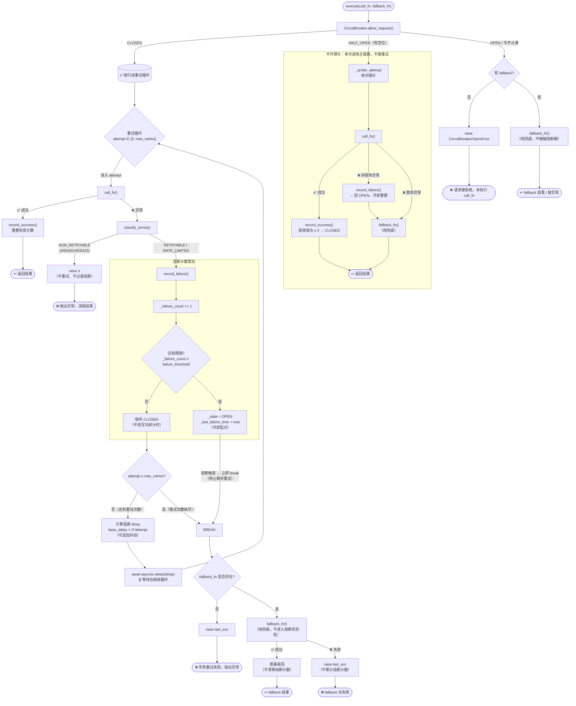

# RetryHandler 设计文档

> **模块**：`app/services/llm/retry.py`
> **职责**：LLM API 调用的重试、熔断与降级

---

## 目录

- [设计目标](#设计目标)
- [核心概念解释](#核心概念解释)
- [架构总览](#架构总览)
- [组件详解](#组件详解)
  - [RetryConfig — 重试配置](#retryconfig--重试配置)
  - [CircuitBreaker — 熔断器](#circuitbreaker--熔断器)
  - [RetryHandler — 重试执行器](#retryhandler--重试执行器)
  - [classify_error — 错误分类](#classify_error--错误分类)
- [执行流程](#执行流程)
- [讨论与决策](#讨论与决策)
- [配置项清单](#配置项清单)
- [边界情况](#边界情况)
- [附录：问题 1 改造设计（工业级熔断判定）](#附录问题-1-改造设计工业级熔断判定)

---

## 设计目标

1. **自动恢复**：临时故障（超时、5xx）自动重试，无需上层感知
2. **自适应保护**：连续故障时熔断，防止对已宕机的下游发无用请求
3. **优雅降级**：主模型不可用时自动切换备用模型，保证服务不中断
4. **拒绝羊群效应**：指数退避 + 随机抖动，避免多并发同时重试

---

## 核心概念解释

### 指数退避（Exponential Backoff）

每次重试的等待时间按指数增长：

```
delay = base_delay × 2^attempt
```

- attempt=0 → 1s
- attempt=1 → 2s
- attempt=2 → 4s
- attempt=3 → 8s

上限由 `max_delay` 控制（默认 30s）。

**直觉**：第一次失败可能是瞬时的，短等即可；连续失败说明问题更严重，给对方更长的恢复时间。

### 随机抖动（Jitter）

在退避延迟上叠加随机值：

```
delay = random.uniform(0, base_delay × 2^attempt)
```

**为什么需要**：没有抖动的退避算法中，多个同时失败的请求会在完全相同的时刻重试（t=1s, t=2s, t=4s...），制造出周期性的流量尖峰，叫"羊群效应"（thundering herd）。抖动将重试时间打散，降低对下游的瞬时压力。

### 熔断器（Circuit Breaker）

参考电路断路器的概念，三种状态：

```
CLOSED（关闭/正常）──连续失败≥阈值──→ OPEN（开启/熔断）
    ↑                               │
    │                               │ recovery_timeout 超时
    │                               ▼
    │                          HALF_OPEN（半开/探测）
    └── 连续 N 次探针都成功 ────┘
           任一次探针失败 ────────→ OPEN（继续熔断）
```

- **CLOSED**：正常状态，所有请求放行
- **OPEN**：熔断状态，请求快速拒绝（有 fallback 则走纯兜底，无则抛 `CircuitBreakerOpenError`），不调用 API
- **HALF_OPEN**：恢复探测状态，放行 `N` 个探针请求，要求**全部连续成功**才恢复，任何一个失败则回到 OPEN

### 半开探针（Half-Open Probe）

熔断后，系统需要知道下游是否已恢复。`recovery_timeout` 超时后进入半开状态，放行 `half_open_max_requests` 个探针请求：

- **所有探针全部连续成功** → 熔断器关闭，恢复正常
- **任何一个探针失败** → 熔断器重新开启，计时器重置，已积累的成功计数清零

每个探针都是**单次调用**（走 `_probe_attempt`，不进入重试循环）——一次探测失败若被重试放大成多次调用，会干扰对下游恢复状态的判断。

`half_open_max_requests`（默认 3）要求多次验证后才恢复，避免单个探针因网络抖动导致误恢复。

### 降级 / Fallback

主模型全部重试失败后，尝试调用备用模型（如 gpt-4o → deepseek-chat）：

```
主模型 call_fn → 重试 N 次 → 全部失败
    → fallback_fn（备用模型）→ 成功 → 直接返回（不触碰熔断器）
    → fallback_fn 也失败 → 抛出最后一次异常
```

Fallback 的目的是**保证服务不中断**——响应可能不是最好的模型生成的，但总比没有响应好。

> **关键约束**：fallback 是**纯兜底**，其成败**完全不进入熔断状态机**（不调用 `record_success`/`record_failure`）。熔断器只观察主链路（`call_fn`）的健康：备用链路通不能证明主链路恢复，备用链路故障也不代表主链路故障。主链路的故障—恢复判定只由主链路自身给出：CLOSED 下主链路成功即清零失败计数；熔断（OPEN）后，恢复只能由半开探针验证。

### 羊群效应（Thundering Herd）

多个并发请求同时失败后，在相同的退避时间点同时重试，形成周期性的"冲击波"。抖动（jitter）通过随机化重试时间打破这种同步。

---

## 架构总览

```
                 RetryHandler
                     │
        ┌────────────┼────────────┐
        ▼            ▼            ▼
   RetryConfig  CircuitBreaker  classify_error
        │            │            │
   max_retries  failure_threshold  超时→RETRYABLE
   base_delay   recovery_timeout   5xx→RETRYABLE
   max_delay    half_open_max      429→RATE_LIMITED
   use_jitter                     4xx→NON_RETRYABLE
```

### 分层关系

| 层     | 组件               | 职责                         |
| ------ | ------------------ | ---------------------------- |
| 配置层 | `RetryConfig`      | 重试参数（次数、退避、抖动） |
| 保护层 | `CircuitBreaker`   | 熔断状态机（关闭/开启/半开） |
| 判定层 | `classify_error()` | 异常分类（可重试/致命/限流） |
| 编排层 | `RetryHandler`     | 整合上述三者的主循环         |

---

## 组件详解

### RetryConfig — 重试配置

```python
@dataclass
class RetryConfig:
    max_retries: int = 2        # 最大重试次数（不含首次）
    base_delay: float = 1.0     # 退避基数（秒）
    max_delay: float = 30.0     # 退避上限（秒）
    use_jitter: bool = True     # 是否启用随机抖动
```

**关于 max_retries**：值为 2 时实际最多执行 3 次（首次 + 重试 2 次）。这是与 `range(max_retries + 1)` 的配合约定。

### CircuitBreaker — 熔断器

```python
@dataclass
class CircuitBreaker:
    failure_threshold: int = 5               # 连续失败 N 次后熔断
    recovery_timeout: float = 30.0           # 熔断持续秒数后进入半开
    half_open_max_requests: int = 3          # 半开状态最大探针数
```

**关键方法**：

| 方法               | 触发时机   | 行为                                                                                     |
| ------------------ | ---------- | ---------------------------------------------------------------------------------------- |
| `allow_request()`  | 每次执行前 | CLOSED/探针→True；OPEN→False；半开耗尽→False                                            |
| `record_success()` | 执行成功   | HALF_OPEN 下累计连续成功，达阈值才关闭；CLOSED 下重置；**OPEN 下 no-op**（见下）          |
| `record_failure()` | 执行失败   | 返回 `bool`；累计计数达阈值→OPEN；半开失败→OPEN 并清空成功；OPEN 下 no-op（见下）       |

**状态机细节**：

- `OPEN→HALF_OPEN` 切换时，当前请求作为第一个探针（`half_open_requests=1`），所以 `half_open_max_requests=3` 时共放行 3 个探针，第 4 个拒绝
- `HALF_OPEN` 下需要**全部探针连续成功**才关闭熔断器（`_consecutive_successes ≥ half_open_max_requests`），任何一个失败则回到 OPEN 并清空成功计数
- CLOSED 下的 `record_success()` 仅重置计数器，不改变状态
- **OPEN 下的 `record_success()` 是 no-op**（防御）：正常路径下 OPEN 不会执行 call_fn（`allow_request()` 会拒绝它），此状态收到成功只能来自外部误调用，不得据此关闭熔断器
- `record_failure()` 返回 `True` 表示本次失败**触发了 OPEN**，调用方（RetryHandler）应立即停止剩余重试
- **`_last_failure_time` 只在熔断器"进入 OPEN"那一刻更新**（冷却期起点）。OPEN 期间的延续失败不再改写它——否则 `allow_request()` 的 `now - _last_failure_time >= recovery_timeout` 判定被反复推迟，熔断器永远进不了 HALF_OPEN，下游已恢复也探测不到。探针失败（HALF_OPEN→OPEN）属于新一轮故障，重置冷却计时。fallback 与熔断器隔离（不调用 `record_failure`），所以 OPEN 期间的失败来源已不存在——该守卫是防御性保护

### RetryHandler — 重试执行器

```python
class RetryHandler:
    def __init__(self, config=None, circuit_breaker=None):
        self.config = config or RetryConfig()
        self.circuit_breaker = circuit_breaker or CircuitBreaker()

    async def execute(self, call_fn, fallback_fn=None) -> Any:
```

**设计要点**：

- `call_fn` 和 `fallback_fn` 都是 `Callable[[], Awaitable[Any]]`——零参数的可等待函数，通过闭包捕获上下文
- 熔断检查在**重试循环之前**：CLOSED 放行进重试循环；HALF_OPEN 走单次探针（`_probe_attempt`）；OPEN（或半开探针占满）拒绝主调用——有 fallback 则走纯兜底，无则抛 `CircuitBreakerOpenError`
- 重试循环**仅 CLOSED 下执行**；`record_failure()` 返回 `True`（本次失败触发 OPEN）时**立即 break**，停止剩余重试
- fallback 是**纯兜底**：成功/失败都不触碰熔断器（不调用 `record_success`/`record_failure`）——熔断器只观察主链路 `call_fn` 的成败

### classify_error — 错误分类

```python
RETRYABLE      # 超时、5xx → 重试 + 计入熔断计数
RATE_LIMITED   # 429 → 重试 + 计入熔断计数
NON_RETRYABLE  # 400/401/403/422 → 直接抛出，不重试
```

**分类规则**：

| 异常 / HTTP 状态                   | 分类                  | 处理           |
| ---------------------------------- | --------------------- | -------------- |
| `TimeoutError` / `APITimeoutError` | RETRYABLE             | 重试           |
| 5xx（500-599）                     | RETRYABLE             | 重试           |
| 429 / `RateLimitError`             | RATE_LIMITED          | 重试           |
| 400 / 401 / 403 / 422              | NON_RETRYABLE         | 直接抛出不重试 |
| 其他异常                           | RETRYABLE（保守兜底） | 重试           |

---

## 执行流程

### 完整流程图



### 计数器累加详解

熔断器内部有三个核心计数器：

| 计数器       | 字段                     | 累加时机                         | 清零时机                                     |
| ------------ | ------------------------ | -------------------------------- | -------------------------------------------- |
| 连续失败计数 | `_failure_count`         | 每次 `record_failure()` +1（**OPEN 下除外**：熔断期间冻结） | `record_success()` → 0        |
| 半开探针计数 | `_half_open_requests`    | `allow_request()` 放行探针时 +1  | `record_success()` → 0；`OPEN→HALF_OPEN` → 1 |
| 连续成功计数 | `_consecutive_successes` | 半开下每次 `record_success()` +1 | 熔断关闭时 → 0；半开中失败 → 0               |

### 场景推演：一次完整的"熔断-恢复"周期

以下推演使用默认配置：`max_retries=2`、`failure_threshold=5`、`half_open_max_requests=3`。

```
熔断器初始状态：CLOSED, _failure_count=0

─────────────────────────────────────────
请求 A（第 1 次请求）
─────────────────────────────────────────
  attempt=0 → call_fn() → ❌ 超时（RETRYABLE）
    record_failure() → _failure_count=1  ← 未达阈值 5
    退避 ~1s
  attempt=1 → call_fn() → ❌ 超时
    record_failure() → _failure_count=2
    退避 ~2s
  attempt=2 → call_fn() → ❌ 超时
    record_failure() → _failure_count=3
    重试耗尽 → fallback_fn → ❌ 也失败
    ★ fallback 纯兜底：失败不记录熔断（不调用 record_failure），
      异常自然抛出（raise last_exc）
  raise last_exc

熔断器状态：CLOSED, _failure_count=3

─────────────────────────────────────────
请求 B（第 2 次请求）
─────────────────────────────────────────
  attempt=0 → call_fn() → ❌ 超时
    record_failure() → _failure_count=4  ← 未达阈值 5
    退避 ~1s
  attempt=1 → call_fn() → ❌ 超时
    record_failure() → _failure_count=5  ← 达到阈值 5！
    record_failure() 返回 True → _state = OPEN
    ★ 熔断触发 → 立即 break，不再执行剩余重试
    （修复前：会继续 attempt=2，浪费 1 次调用 + 退避等待）
  → 无 fallback → raise last_exc

熔断器状态：OPEN, _failure_count=5, _last_failure_time=T2

─────────────────────────────────────────
请求 C ~ F（第 3~6 次请求，熔断持续中）
─────────────────────────────────────────
  每次 allow_request() → OPEN → False
  ← 全部抛出 CircuitBreakerOpenError
  ★ 不执行 call_fn，不消耗 API 配额
  ★ 不累加 _failure_count（请求未到 record_failure 环节就被拒绝了）

熔断器状态：OPEN（T2 开始计时）

─────────────────────────────────────────
T2 + 30s 后 → 请求 G（探针 #1）
─────────────────────────────────────────
  allow_request()：
    检测到 now - T2 ≥ recovery_timeout(30s)
    → _state = HALF_OPEN
    → _half_open_requests = 1
    → 放行（探针 #1）

  单次调用（探针不进入重试循环）→ call_fn() → ✅ 成功！
  record_success() → _consecutive_successes=1  ← 1/3
  ↩ 返回结果

熔断器状态：HALF_OPEN（还需 2 次成功）

─────────────────────────────────────────
请求 H（探针 #2）
─────────────────────────────────────────
  allow_request() → HALF_OPEN, 有空位 → 放行

  单次调用（探针不进入重试循环）→ call_fn() → ✅ 成功！
  record_success() → _consecutive_successes=2  ← 2/3
  ↩ 返回结果

熔断器状态：HALF_OPEN（还需 1 次成功）

─────────────────────────────────────────
请求 I（探针 #3）
─────────────────────────────────────────
  allow_request() → HALF_OPEN, 有空位 → 放行

  单次调用（探针不进入重试循环）→ call_fn() → ✅ 成功！
  record_success() → _consecutive_successes=3 ≥ 3
    → _state = CLOSED
    → _failure_count, _half_open_requests, _consecutive_successes 全部清零
  ↩ 返回结果

熔断器已恢复：CLOSED，全部计数器=0

★ 如果探针 #2 或 #3 中任一个失败：
  record_failure() → _state = OPEN, _consecutive_successes = 0
  熔断器重新开启，等待下一个 recovery_timeout
  （若配置了 fallback：探针失败后调用 fallback_fn 纯兜底返回给用户，
   不触碰熔断器——熔断器只观察主链路探针的成败）

★ 探针失败后的流程（问题 4 修复）：探针走**单次调用**路径
  （`_probe_attempt`），不做重试。修复前探针失败 → OPEN 后仍继续重试，
  若重试恰好成功，`record_success()` 在 OPEN 下会误把熔断器关回 CLOSED——
  下游实际未恢复，后续请求全部放行打向故障服务。修复后：
  ① 探针不重试，失败即确认未恢复、回 OPEN；
  ② `record_success()` 在 OPEN 下为 no-op（防御），无法关闭熔断器。
  双重防护。
```

### 关键边界说明

**熔断触发后当前请求的剩余重试立即停止**（问题 2 修复）。`record_failure()` 返回 `True`（表示本次失败把熔断器切换到了 OPEN）时，重试循环立即 `break`，不再对已确认故障的下游发无用请求、也不再空等退避延迟。此前"熔断不影响当前请求已分配重试次数"的设计是错误的：那会让一个请求在熔断触发后仍继续打已确认故障的下游，浪费配额并放大失败信号。

提前退出循环的情况有二：`classify_error` 返回 `NON_RETRYABLE`（直接 raise），或 `record_failure()` 返回 `True`（熔断触发）。

**熔断期间熔断器计数与冷却计时保持冻结**。熔断 OPEN 时 `allow_request()` 拒绝主调用（有 fallback 则走纯兜底），`call_fn` 从未被执行，`record_failure()` 不会被正常调用；即便外部误调用，OPEN 下 `record_failure()` 也是 **no-op**（不累加 `_failure_count`、不改写 `_last_failure_time`）。所以 `_failure_count` 在熔断期间保持不变，直到 `record_success()` 将其清零。

### 修复记录（问题 2 / 问题 4）

| 问题 | 修复前 | 修复后 |
| ---- | ------ | ------ |
| 问题 2：熔断触发后仍继续剩余重试 | `record_failure()` 触发 OPEN 后重试循环照常跑完剩余 attempt，浪费配额、延迟放大 | `record_failure()` 返回 `bool`，触发 OPEN 时立即 `break` |
| 问题 4a：半开探针进入重试循环 | 探针失败 → OPEN → 继续重试，把一次探测放大成多次调用，干扰恢复判断 | 半开状态走 `_probe_attempt`：单次调用，失败即确认未恢复 |
| 问题 4b：OPEN 下 `record_success()` 误关熔断 | OPEN 下收到成功（重试泄漏 / fallback）走"重置为 CLOSED"兜底分支，熔断器被误关 | OPEN 下 `record_success()` 为 no-op |
| 修复补充：`_last_failure_time` 被延续失败反复刷新 | 任何失败都刷新 `_last_failure_time`，OPEN 下 fallback 兜底失败把冷却期无限推迟，熔断器永远无法进入 HALF_OPEN | `_last_failure_time` 仅在熔断器进入 OPEN 时更新（冷却期起点）；OPEN 下延续失败不改写，探针失败（新一轮故障）重置 |
| 问题 4 深化：fallback 成败不进入熔断状态机 | fallback 成功清零熔断计数（主链路持续故障永不熔断）；fallback 失败累计熔断计数；熔断 OPEN 期 fallback 被当作主链路传入单次调用路径 | fallback 纯兜底：成功直接返回、失败自然抛出，不调用 `record_success`/`record_failure`，熔断器只观察主链路 `call_fn` |
| 审核补充：OPEN 下 `record_failure()` 未冻结计数 | OPEN 守卫在 `_failure_count += 1` **之后**，外部误调用（或防御路径）会继续累加计数、破坏"熔断期间冻结"语义，熔断消息里的"连续失败"数失真 | OPEN 守卫前置到累加之前：OPEN 下不累加 `_failure_count`、不改写 `_last_failure_time`，返回 `False` |

对应测试：`tests/unit/test_retry.py`（10 个用例）。

---

## 讨论与决策

### Q1: RETRYABLE 错误为什么也要计入熔断计数？

之前的设计只有 `RATE_LIMITED` 才触发熔断，`RETRYABLE`（超时/5xx）不计入。这意味着 5xx 即使连续失败 100 次也不会触发熔断，流量会持续打到宕机的下游。

修复：**所有非致命错误都调用 `record_failure()`**。超时/5xx 和 429 共同累积熔断计数，阈值到达后统一熔断。

### Q2: Fallback 成功要重置熔断器吗？

**不。fallback 的成败与熔断器完全无关**（问题 4 修复后）。

熔断器只观察主链路（`call_fn`）的健康。fallback 是备用链路，纯兜底：

- **成功**：说明备用链路可用，返回给用户即可。不清零熔断计数——否则主链路持续故障时，每次都被 fallback 救场清零计数，熔断器永远不会打开
- **失败**：说明备用链路也不可用。不累计熔断计数、不改写冷却计时——备用链路的故障不是主链路故障的证据

> **修复前**：fallback 成功重置熔断器（乐观恢复），失败计入熔断计数。这导致：① 主链路持续故障但熔断永不触发（计数被救场清零）；② 备用链路故障被误记到主链路熔断器；③ 熔断 OPEN 期 fallback 被当作主链路传入单次调用路径，备用链路的失败累计进主链路冷却期。

### Q3: max_retries、failure_threshold、half_open_max_requests 三者有什么关系？一般怎么设置？

这三个参数在故障生命周期中控制**不同阶段**：

```
时间轴：  首次失败 → 重试 → 重试 → ... → 熔断开启 → 等待 recovery → 半开探针 → 关闭/继续熔断
           ├──────── max_retries 控制 ────────┤
                                              ├ failure_threshold 控制┤
                                                                      ├ half_open_max_requests ┤
```

- **`max_retries`** — 单次请求的"挣扎"次数。控制一个请求在放弃前尝试几次
- **`failure_threshold`** — 熔断器连续失败的容忍次数，计数单位是**单次 `call_fn()` 的失败**，每次 `record_failure()` 加 1
- **`half_open_max_requests`** — 恢复时的"验证"数量。控制半开状态下放行几个探针验证下游是否恢复

#### 关系 1：`failure_threshold` 应 ≥ `max_retries + 1`

不然一次请求的多次重试就可能打满熔断阈值，把单次波动放大成熔断：

```python
# 反例：
max_retries = 3       # 1 次请求最多重试 3 次
failure_threshold = 2 # 连续 2 次失败就熔断

# 场景：API 短暂超时
# 请求 A（3 次重试全部超时）→ 失败计数 +4 → 阈值 2 → 熔断！
# 其他正常请求被熔断拒绝
```

如果一次请求的重试次数 ≥ 熔断阈值，**一次临时抖动就能把电路打爆**。当前默认值 `max_retries=2, threshold=5` 比较安全（3 次尝试 vs 5 次阈值）。

#### 关系 2：`half_open_max_requests` 决定恢复速度 vs 稳定性的权衡

- **太小（1）**：一个探针成功就恢复，但如果探针刚好走运（网络抖动），恢复后立刻被正常请求打爆 → 频繁开关
- **太大（10）**：半开期放行大量探针，如果下游仍故障，这些探针都白费 → 恢复慢 + Token 浪费

一般 3~5 之间，和熔断阈值配合：**阈值大（保守）→ 半开探针可以多一些**，因为阈值已过滤了偶然波动，恢复时要更确信下游已恢复。

#### 关系 3：`max_retries + failure_threshold` → 熔断的真实灵敏度

真正决定"多久熔断"的是——`failure_threshold` 计数的是**单次 `call_fn()` 的失败**，而一个 `execute()` 会多次调用 `call_fn()`：

- `threshold=5, max_retries=2` → 5 次 `call_fn()` 失败后熔断。一次 `execute()` 最多执行 3 次 `call_fn()`（attempt 0 + 2 次重试），所以约 **2 次请求**就能触达阈值
- `threshold=5, max_retries=0` → 5 次请求（无重试）后熔断
- `threshold=3, max_retries=1` → 3 次 `call_fn()` 失败后熔断，约 **2 次请求**触达阈值

#### 典型组合策略

| 场景                 | max_retries | failure_threshold | half_open | 理由                                                 |
| -------------------- | ----------- | ----------------- | --------- | ---------------------------------------------------- |
| **默认保守**         | 2           | 5                 | 3         | 约 2 次请求（5 次 call_fn 失败）后熔断，容忍偶发波动 |
| **高可用/敏感**      | 1           | 3                 | 2         | 约 2 次请求（3 次 call_fn 失败）后快速熔断           |
| **深度容错**         | 3           | 10                | 5         | 约 3~4 次请求后才熔断，API 不稳定时尽可能多试        |
| **不熔断（纯重试）** | 2           | 999               | 3         | 开大阈值等于禁用熔断，只做重试不保护                 |

当前默认值走的是**保守路线**——平衡了偶发波动和大面积故障。如果要更紧一点，把 `threshold` 降到 3 比把 `max_retries` 降到 0 更合理（保留重试的恢复能力，只缩短熔断触发的窗口期）。

### Q4: 为什么 `RetryConfig` 和 `CircuitBreaker` 的默认值不从代码硬编码而是从 settings 读取？

保证**运行时统一可配**。所有 LLM 子包的重试行为都由 `app/config/settings.py` 集中控制，修改 `.env` 即可调整，无需改代码。对应关系见下方配置项清单。

### Q4: 为什么不引入 `tenacity` 等第三方重试库？

- 本项目需要熔断器 + fallback + 错误分类的紧耦合编排，`tenacity` 的重试装饰器模式不适合这种控制流
- 熔断器需要跨请求共享状态（类级别），装饰器模式难以表达
- 重试逻辑本身不到 100 行，自实现更透明、易调试

---

## 配置项清单

所有配置项集中在 `app/config/settings.py`，通过 `.env` 覆盖：

| 配置项                               | 默认值 | 说明                         | 关联组件                                |
| ------------------------------------ | ------ | ---------------------------- | --------------------------------------- |
| `LLM_MAX_RETRIES`                    | `2`    | 最大重试次数                 | `RetryConfig.max_retries`               |
| `LLM_BASE_DELAY`                     | `1.0`  | 退避基数（秒）               | `RetryConfig.base_delay`                |
| `LLM_MAX_DELAY`                      | `30.0` | 退避上限（秒）               | `RetryConfig.max_delay`                 |
| `LLM_USE_JITTER`                     | `True` | 是否启用随机抖动             | `RetryConfig.use_jitter`                |
| `LLM_CIRCUIT_FAILURE_THRESHOLD`      | `5`    | 连续失败熔断阈值             | `CircuitBreaker.failure_threshold`      |
| `LLM_CIRCUIT_RECOVERY_TIMEOUT`       | `30.0` | 熔断恢复到半开的时间（秒）   | `CircuitBreaker.recovery_timeout`       |
| `LLM_CIRCUIT_HALF_OPEN_MAX_REQUESTS` | `3`    | 半开状态最大探针数           | `CircuitBreaker.half_open_max_requests` |
| `LLM_FALLBACK_MODEL_ID`              | `""`   | 降级备用模型 ID（空=不启用） | `RetryHandler.fallback_fn`              |

---

## 边界情况

1. **熔断 OPEN 时的请求**：不执行 `call_fn`。有 `fallback_fn` 时走纯兜底（单次、不重试、不触碰熔断器），保证服务不中断；无 fallback 时抛 `CircuitBreakerOpenError`，调用方应捕获并返回降级响应或错误消息
2. **熔断触发后当前请求的剩余重试立即停止**：`record_failure()` 返回 `True`（本次失败把熔断器切到 OPEN）时重试循环立即 `break`，不再对已确认故障的下游发无用请求
3. **半开探针耗尽**：拒绝主调用（有 fallback 走纯兜底）但不改变熔断状态，直到现有探针完成（成功或失败）
4. **fallback 也失败**：抛出最后异常（可能是 fallback 的异常或主模型的异常，取决于哪个是 last_exc）；fallback 的成败不进入熔断状态机
5. **OPEN 下防御性 no-op**：`record_success()`/`record_failure()` 在 OPEN 下均不修改任何状态（成功不得关闭熔断器，失败不得累计计数、不得改写冷却计时）
6. **并发熔断状态竞争**：`CircuitBreaker` 不是线程安全的，但 `RetryHandler` 在 asyncio 单线程事件循环中运行，无并发问题
7. **`max_retries=0`**：不重试，但熔断器仍然生效。首次失败后 `record_failure()` 被调用，计数器累积

---

## 附录：问题 1 改造设计（工业级熔断判定）

> **状态：待审查**。本附录是问题 1 的**设计提案**，尚未实现。用户审查确认后按此实施，并同步更新上方正文（方法表 / 流程图 / 场景推演 / 配置项）。

### 背景与现状问题

当前熔断判据是 `_failure_count ≥ failure_threshold`（[retry.py:100](app/services/llm/retry.py#L100)），即**连续失败次数**。问题有三：

| #     | 问题                                                                                                  | 后果                                                                                                                 |
| ----- | ----------------------------------------------------------------------------------------------------- | -------------------------------------------------------------------------------------------------------------------- |
| 1     | **计数粒度错位**：计数单位是单次 `call_fn()`，而一次 `execute()` 会多次调用 `call_fn()`（重试循环）   | 一次请求的多次重试失败被当作多次独立失败累计，**熔断极易触发**（`threshold=5, max_retries=2` 时约 2 次请求即熔断）   |
| 2     | **无时间维度**：失败计数从 CLOSED 起只增不减，无窗口约束                                              | 5 次失败分布在 1 秒或 10 分钟同样触发熔断——低流量下误熔断，高流量下反应过慢                                          |
| 3     | **429 混入熔断判据**：`RATE_LIMITED` 也计入 `_failure_count`                                          | 429 是"客户触发自身限流"，不是"下游故障"证据，限流期误熔断                                                           |

### 工业级参考：Hystrix 熔断模型

| 维度       | 当前实现           | Hystrix 工业标准                                                                               |
| ---------- | ------------------ | ---------------------------------------------------------------------------------------------- |
| 判据       | 连续失败计数       | **错误率**（失败 / 窗口内总请求 ≥ 阈值，默认 50%）                                             |
| 时间       | 无窗口             | **滑动时间窗口**（默认 10s）                                                                   |
| 防误触发   | 无                 | **最小请求量门槛**（`requestVolumeThreshold`，默认 20/窗口）——窗口内请求量不足则不做熔断评估   |
| 计数粒度   | 单次 `call_fn()`   | 单次命令执行（请求粒度）                                                                       |
| 429        | 计入熔断           | 单独处理（只退避，不计入错误率）                                                               |

### 改造方案

#### 1. 计数粒度：请求粒度（execute）替代 call_fn 粒度

- 每个 `execute()` 只向熔断器汇报**一次**结果（成功 / 失败 / 忽略），由 `RetryHandler` 汇总重试结果后统一汇报，而非每次 `call_fn()` 失败都调 `record_failure()`
- 避免单次请求的多次重试放大熔断计数

#### 2. 滑动时间窗口：替换"从 CLOSED 起的永久计数"

- 窗口统计 `[now - window, now]` 内的请求总数与失败数，窗口滑动（旧记录过期即弃）
- 实现：环形缓冲区 / 双指针队列记录 `(timestamp, success/failure)`，O(1) 追加，惰性清理过期条目
- **本请求完成后更新统计**：窗口统计当前请求的成败，作为**后续请求**是否放行的依据

#### 3. 熔断判定：错误率 + 最小请求量门槛

```
CLOSED 下每次请求完成后：
    滑动窗口更新（总请求 +1，成败各归其位）
    if 窗口内总请求 ≥ request_volume_threshold      # 最小请求量，防低流量误判
       and 窗口内错误率 ≥ error_threshold:           # 默认 50%
        → OPEN
```

#### 4. 429 分离：只退避，不参与熔断评估

- 429 失败**不计入错误率分母或分子**，也不计入总请求量
- 429 失败触发**退避重试**（尊重 `Retry-After`），与"下游故障"的 5xx / 超时路径彻底分离

### 新配置项（拟）

| 配置项（settings）                       | 默认值   | 说明                                       |
| ---------------------------------------- | -------- | ------------------------------------------ |
| `LLM_CIRCUIT_WINDOW_SECONDS`             | `10.0`   | 滑动时间窗口长度（秒）                     |
| `LLM_CIRCUIT_ERROR_THRESHOLD`            | `0.5`    | 窗口内错误率熔断阈值（50%）                |
| `LLM_CIRCUIT_REQUEST_VOLUME_THRESHOLD`   | `20`     | 窗口内最小请求量，不足则不做熔断评估       |

原 `LLM_CIRCUIT_FAILURE_THRESHOLD`（连续失败计数）将被上述配置替代。

### 行为对比（示意）

```
熔断器状态：CLOSED

请求 A（窗口内第 1~5 次）→ 5 次失败，但窗口内总请求 < 20 → 不熔断（防低流量误判）
请求 B（窗口内第 20~25 次）→ 20 次请求中 15 次失败 → 错误率 75% ≥ 50% → 熔断
请求 C（窗口内 429 增多）→ 429 不计入错误率 → 不熔断，仅退避重试
```

### 待确认决策点

1. **保留还是移除 `failure_threshold`**：提案为用错误率 + 窗口完全替代；若希望保留"连续失败"语义作为辅助判据（双判据），需确认
2. **429 的退避**：当前 `_calculate_delay` 无 `Retry-After` 感知；是否本次一并支持（尊重服务端退避时间）
3. **窗口内"请求量不足"时的默认行为**：提案为不评估（保持 CLOSED）；备选为「窗口内总请求足够但失败全部」时仍熔断（低流量下的纯失败保护）
