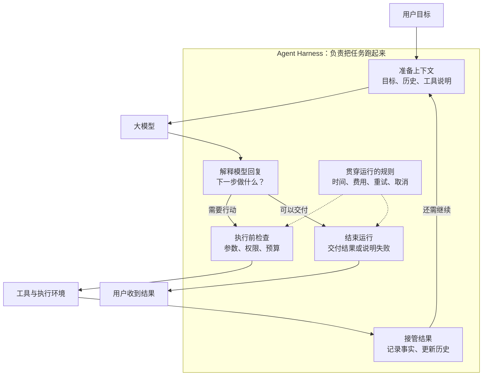
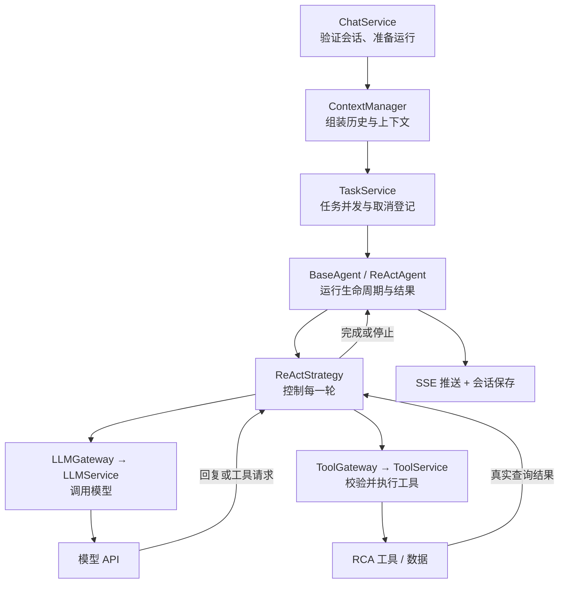

# Agent Harness 架构：从理论到 Agent Forge

> 讨论与源码只读核查日期：2026-09-14；保存日期：2026-09-15。
> 定位：本次讨论的完整讲解与教学示例，供后续持续更新；不是新的架构决策或实施授权。
> 配套：[交互 HTML 图解](agent-harness.html)。Markdown 是讲解正文，HTML 是配套展示，两种格式同步维护。
> 证据边界：本次讨论未运行业务验证。文中“当前”指上述核查时点；最新实现状态以 [ALIGNMENT](../ALIGNMENT.md)、[当前计划](../todo.md)及实际源码/测试为准。

## 一个容易理解的定义

**Agent Harness，就是让模型能够持续做事的运行系统：给它材料、执行它提出的动作、检查结果，并控制何时继续、何时停止。**

可以把它想成一间工作室：

- **模型**：会思考的助手，提出下一步做什么。
- **工具**：查询数据、读文件、运行程序的设备。
- **Harness**：安排工作、传递材料、检查操作和收尾的程序。

## ① 理论架构：先看那个不断运行的“圈”

下面采用广义工程视角。Harness 没有统一规定的目录结构，也不要求多 Agent；核心是调用模型、分发工具调用，并根据结果推进任务的循环。参考 [Anthropic 的架构说明](https://www.anthropic.com/engineering/managed-agents)。

以下保留讨论中的 Mermaid 图，便于在支持 Mermaid 的 Markdown 阅读器中查看；离线可视化见配套 HTML 的“理论架构”。

最关键的是：**模型说“查询这个设备”，只是提出请求。Harness 才会检查请求、调用查询工具，并把真实结果交回模型。**

它通常需要回答这些问题：

| 问题 | Harness 的职责 |
| --- | --- |
| 模型这一轮能看到什么？ | 选择历史、工具说明和相关材料 |
| 模型要求调用工具怎么办？ | 解析、校验、授权、执行 |
| 失败后怎么办？ | 区分可修正、可重试和必须停止的错误 |
| 怎么避免一直运行？ | 限制轮数、时间、费用，处理取消 |
| 做过什么、产出了什么？ | 记录结果、用量和运行状态 |

长期任务还需要保存可恢复的进度，避免下一次启动后重新猜测做过什么；这比单纯保存聊天记录要求更高。参考 [长任务 Harness 的实践](https://www.anthropic.com/engineering/effective-harnesses-for-long-running-agents)。

图中的框表示控制职责：模型推理、真实工具执行和持久化存储由外围能力提供，不要求部署在同一进程。

## ② 对照当前项目：Harness 分布在哪？

项目已经具有 Harness 的主要构件，**它横跨多个模块，而不是某一个叫 `Agent` 的类。**

以当时的聊天入口为例：

几个容易混淆的模块，可以这样区分：

| 项目模块 | 用一句话理解 |
| --- | --- |
| [ReActStrategy](../../app/domain/reasoning/react.py) | **整项任务下一步怎么走**：继续问模型、执行工具，还是结束 |
| [LLMService](../../app/integration/llm/llm_service.py) | **一次模型调用怎么完成**：请求预算、限流、重试、流处理和用量结算 |
| [ToolExecutor](../../app/integration/tools/executor.py) | **一次工具动作怎么执行**：前置检查、执行、结果处理和事实接管 |
| [ContextManager](../../app/application/context/context_manager.py) | **这一轮带哪些材料给模型**：组装消息、裁剪历史 |
| [BaseAgent](../../app/domain/agent/base.py) | **管理一次运行的生命周期**：状态、事件、结果与异常 |
| [Container](../../app/container.py) | **把组件接起来**：创建实现、注入依赖，不负责每轮推理 |

`LLMGateway`、`ToolGateway` 可以理解为统一插座：ReAct 按接口调用，具体模型和工具服务插在另一端。换模型适配器，不必重写业务循环。

补充几个在交互图中展示的边界：

- **运行策略**：ReAct 负责“问模型 → 看回复 → 执行工具 → 再问”；Planner 增加计划与步骤，Reflection 增加检查与修正。
- **上下文与记录**：SessionManager 保存会话，ContextManager 选择本轮送给模型的历史。保存聊天记录，不等于能恢复中断的整项任务。
- **工具执行约束**：审批能力存在，但默认审批策略放行；完整工具生命周期仍在建设。不能仅凭有审批类就宣称具备强制人工审批。

## ③ 用项目里的良率排查走一遍

用户问：

> LOT-A123 的良率为什么降到 82%？

下面是根据仓库 [RCA 固定模拟数据](../../app/integration/tools/builtin/rca/data.py)构造的教学路线，不是本次实际执行记录。模型实际选择的工具和调用顺序可能不同。

### 第一步：准备工作

`ChatService` 验证会话、保存问题；`ContextManager` 按消息 ID 快照整理历史；ChatService 为本次运行
创建身份、预算和取消信号，路由只负责 HTTP/SSE 与断连适配。

对应链路：`chat.py → ChatService → ContextManager → TaskService → BaseAgent.run`。

### 第二步：模型提出调查动作

ReAct 通过 LLMService 问模型。模型可能返回：“调用 `query_batch_yield`，查询 LOT-A123。”

这时，模型还没有查到任何数据。

对应链路：`ReActStrategy → LLMGateway → LLMService → 模型 API`。

### 第三步：Harness 执行查询

ToolService 将请求交给工具执行链。参数检查通过后，工具返回模拟事实：ETCH 工序良率为 82%，关联设备为 ETCH-01。

对应链路：`ToolGateway → ToolService → ToolExecutor → query_batch_yield`。

### 第四步：带着证据继续问

ReAct 将工具结果加入历史。模型据此继续查询设备告警、腔体压力、缺陷分布或历史案例。每轮仍受次数、时间、费用和取消规则约束。

对应链路：`工具结果 → ReAct 历史 → LLM`。这里带回的是工具提供的事实，不是模型自己猜出来的数据。

### 第五步：交付并收尾

模型汇总证据，提出腔体压力异常及清洁维护的调查方向。运行系统结束循环、组装结果、推送事件并保存答复。

对应链路：`ReActOutcome → AgentResult → SSE / SessionManager`。

这里，**调查方向由模型提出；真实数据由工具提供；行动顺序、执行约束和结果传递由 Harness 落实。** 本例中的工具数据为模拟数据，结论用于解释运行过程，不代表真实工厂的诊断。

## ④ 当前项目已经走到哪一步？

以下保留 2026-09-14 讨论时的边界判断；最新状态查 [ALIGNMENT](../ALIGNMENT.md)，工具生命周期的后续实施查 [当前计划](../todo.md)。这里不另行维护模块状态表。

根据当时读取的代码与状态登记，聊天链路已接上 ReAct、模型网关、工具执行、上下文管理和运行控制；Planner、Reflection 也有策略实现。RCA 查询工具使用固定模拟数据。

但长期记忆仍为空壳，完整的持久化恢复、工具后台执行接管以及目标蓝图中的多 Agent 调度平台，不能当作已经完成。

讨论时主任务正在迁移的 Schema 契约，不作为本篇已完成能力展示。此处只保存讨论，不据工作区中的中间改动更新能力结论。

所以，理解当前项目最合适的起点是：**先看一个 ReAct 任务怎样可靠地完成，再看 Planner、Reflection 如何在这个基础上组织更复杂的工作。**

## 后续怎样更新本次讨论

继续更新本文件与同目录 HTML，不新建“最终版”“新版”等并列正文。

1. 模块完成后，先核对源码、真实接线和测试证据，再修订对应图、模块映射和实现边界。
2. 如聊天用例迁移、多 Agent 编排、记忆、checkpoint 或工具生命周期落地，应重走一次案例链路，区分目标设计和实际入口。
3. 保持教学示例与真实执行记录的区别；如补充实际运行，应写明运行条件、日期和观察结果。
4. 同步 HTML 的两种架构视图、五步案例和完整讲解；保留 HTML 无外部脚本依赖、可离线打开的特点。
5. 更新下面的修订记录。模块状态仍只在 ALIGNMENT 正式维护，本篇链接它并说明本轮讲解的核查时点。

| 日期 | 修订内容 | 证据边界 |
| --- | --- | --- |
| 2026-09-15 | 保存 2026-09-14 的理论解释、两张架构图、项目映射和模拟案例；配套交互 HTML | 来源为当次只读核查和官方资料；未运行业务验证 |

## 参考与阅读入口

- [Anthropic：模型、Harness、Session 与执行环境的分离](https://www.anthropic.com/engineering/managed-agents)
- [Anthropic：长任务 Harness 的进度交接与验证](https://www.anthropic.com/engineering/effective-harnesses-for-long-running-agents)
- [项目架构与分层](architecture.md)、[产品定位](product.md)、[实现状态](../ALIGNMENT.md)
- [聊天入口](../../app/api/routes/chat.py)、[聊天用例](../../app/application/chat/chat_service.py)、[任务服务](../../app/application/task/task_service.py)、[ReAct Agent 桥接](../../app/domain/agent/executor.py)
- [交互 HTML 图解](agent-harness.html)
