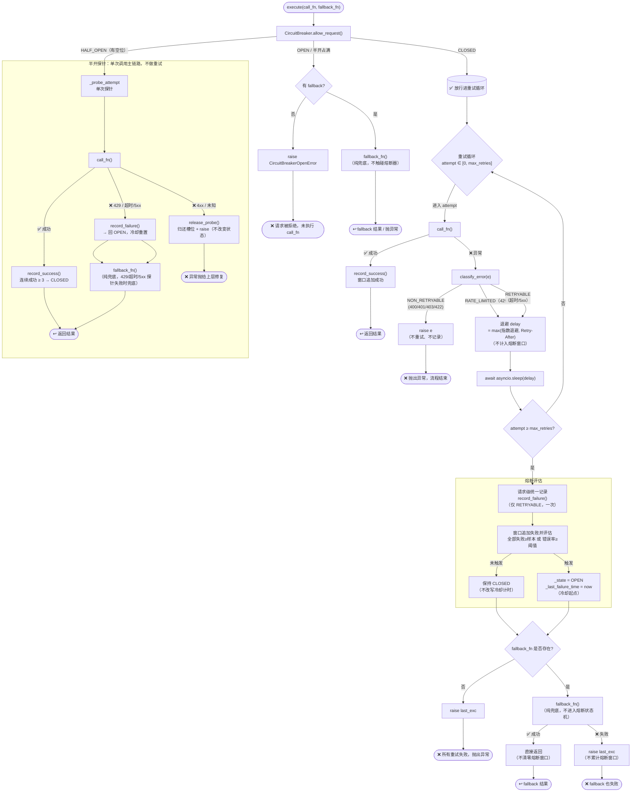

# RetryHandler 设计文档

> **模块**：`app/services/llm/retry.py`
> **职责**：LLM API 调用的重试、熔断与降级

---

## 目录

- [设计目标](#设计目标)
- [核心概念解释](#核心概念解释)
- [架构总览](#架构总览)
- [组件详解](#组件详解)
  - [RetryConfig — 重试配置](#retryconfig--重试配置)
  - [CircuitBreaker — 熔断器](#circuitbreaker--熔断器)
  - [RetryHandler — 重试执行器](#retryhandler--重试执行器)
  - [classify_error — 错误分类](#classify_error--错误分类)
- [执行流程](#执行流程)
- [设计决策](#设计决策)
- [配置项清单](#配置项清单)
- [边界情况](#边界情况)
- [改造记录与工业实践](#改造记录与工业实践)

---

## 设计目标

1. **自动恢复**：临时故障（超时、5xx）自动重试，无需上层感知
2. **自适应保护**：连续故障时熔断，防止对已宕机的下游发无用请求
3. **优雅降级**：主模型不可用时自动切换备用模型，保证服务不中断
4. **拒绝羊群效应**：指数退避 + 随机抖动，避免多并发同时重试

---

## 核心概念解释

### 指数退避（Exponential Backoff）

每次重试的等待时间按指数增长：

```
delay = base_delay × 2^attempt
```

- attempt=0 → 1s，attempt=1 → 2s，attempt=2 → 4s，attempt=3 → 8s
- 上限由 `max_delay` 控制（默认 30s）

**直觉**：第一次失败可能是瞬时的，短等即可；连续失败说明问题更严重，给对方更长的恢复时间。

### 随机抖动（Jitter）

在退避延迟上叠加随机值：

```
delay = random.uniform(0, base_delay × 2^attempt)
```

**为什么需要**：没有抖动的退避中，多个同时失败的请求会在完全相同的时刻重试（t=1s, t=2s, t=4s...），制造周期性的流量尖峰——**羊群效应**（thundering herd）。抖动将重试时间打散，降低对下游的瞬时压力。

### 熔断器（Circuit Breaker）

三种状态：

```
CLOSED（正常）──窗口错误率≥阈值 或 全部失败≥样本 ──→ OPEN（熔断）
    ↑                                                    │
    │                                                    │ recovery_timeout 超时
    │                                                    ▼
    │                                               HALF_OPEN（半开/探测）
    └── 连续 N 次探针都成功 ────────────────────┘
           探针失败（429/超时/5xx）────────────→ OPEN（继续熔断）
```

- **CLOSED**：正常状态，所有请求放行。熔断判定基于**滑动时间窗口**内的错误率（参考 Hystrix）：窗口内总请求达最小请求量且错误率 ≥ 阈值 → 熔断；或窗口内**全部失败**且失败数 ≥ 样本下限（低流量纯失败保护）→ 熔断
- **OPEN**：熔断状态，请求快速拒绝（有 fallback 则走纯兜底，无则抛 `CircuitBreakerOpenError`），不调用 API
- **HALF_OPEN**：恢复探测状态，放行 `half_open_max_requests` 个探针请求，要求**全部连续成功**才恢复；任一失败（429/超时/5xx）则回到 OPEN（4xx/未知不改变状态，归还槽位）

### 半开探针（Half-Open Probe）

熔断后，`recovery_timeout` 超时进入半开状态，放行 `half_open_max_requests` 个探针请求验证下游是否恢复。**每个探针都是单次调用**（走 `_probe_attempt`，不进入重试循环）。

探针结果分类（详见「改造记录与工业实践·半开探针」）：

| 探针结果 | 分类 | 处理 |
| --- | --- | --- |
| 成功（2xx） | 成功 | `record_success()`，累计连续成功，达阈值才关闭 |
| 429 | 失败 | `record_failure()` 回 OPEN + 冷却重置（下游仍过载，停止探测） |
| 超时 / 5xx | 失败 | `record_failure()` 回 OPEN + 冷却重置（下游故障证据） |
| 4xx / 未知 | 无效探测 | **不改变状态 + `release_probe()` 归还槽位 + `raise`**（客户端问题，不算健康探测，等待正常请求探测真实状态） |

### 降级 / Fallback

主模型全部重试失败后，尝试备用模型：

```
主模型 call_fn → 重试 N 次 → 全部失败
    → fallback_fn（备用模型）→ 成功 → 直接返回（不触碰熔断器）
    → fallback_fn 也失败 → 抛出最后一次异常
```

**关键约束：fallback 是纯兜底，其成败完全不进入熔断状态机**（不调用 `record_success`/`record_failure`）。熔断器只观察主链路（`call_fn`）的健康：备用链路通不能证明主链路恢复，备用链路故障也不代表主链路故障。

---

## 架构总览

```
                 RetryHandler
                     │
        ┌────────────┼────────────┐
        ▼            ▼            ▼
   RetryConfig  CircuitBreaker  classify_error
        │            │            │
   max_retries  window_seconds   超时→RETRYABLE
   base_delay   error_threshold  5xx→RETRYABLE
   max_delay    request_volume   429→RATE_LIMITED
   use_jitter   all_failed_min   4xx→NON_RETRYABLE
```

| 层 | 组件 | 职责 |
| --- | --- | --- |
| 配置层 | `RetryConfig` | 重试参数（次数、退避、抖动） |
| 保护层 | `CircuitBreaker` | 熔断状态机（关闭/开启/半开） |
| 判定层 | `classify_error()` | 异常分类（可重试/致命/限流） |
| 编排层 | `RetryHandler` | 整合上述三者的主循环 |

---

## 组件详解

### RetryConfig — 重试配置

```python
@dataclass
class RetryConfig:
    max_retries: int = 2        # 最大重试次数（不含首次）
    base_delay: float = 1.0     # 退避基数（秒）
    max_delay: float = 30.0     # 退避上限（秒）
    use_jitter: bool = True     # 是否启用随机抖动
```

`max_retries=2` 时实际最多执行 3 次（首次 + 重试 2 次），与 `range(max_retries + 1)` 配合。

### CircuitBreaker — 熔断器

```python
@dataclass
class CircuitBreaker:
    window_seconds: float = 10.0             # 滑动时间窗口长度（秒）
    error_threshold: float = 0.5             # 窗口内错误率熔断阈值（50%）
    request_volume_threshold: int = 20       # 窗口内最小请求量，不足则不做错误率评估
    all_failed_min: int = 3                  # 低流量纯失败保护：全部失败且达此样本量才熔断
    recovery_timeout: float = 30.0           # 熔断持续秒数后进入半开
    half_open_max_requests: int = 3          # 半开状态最大探针数
```

**关键方法**：

| 方法 | 触发时机 | 行为 |
| --- | --- | --- |
| `allow_request()` | 每次执行前 | CLOSED/探针→True；OPEN→False；半开耗尽→False |
| `record_success()` | 请求成功 | 窗口追加成功；HALF_OPEN 下累计连续成功，达探针阈值才关闭；**OPEN 下 no-op**（见下） |
| `record_failure()` | 请求失败 | 返回 `bool`；窗口追加失败并评估→OPEN；半开失败→OPEN 并清空成功；OPEN 下 no-op（见下） |
| `release_probe()` | 探针收到 NON_RETRYABLE | 归还探针槽位（`_half_open_requests` 减 1），状态不变；仅 HALF_OPEN 下有效 |

**状态机细节**：

- `OPEN→HALF_OPEN` 切换时，当前请求作为第一个探针（`half_open_requests=1`），所以 `half_open_max_requests=3` 时共放行 3 个探针，第 4 个拒绝
- HALF_OPEN 下
  - **全部探针连续成功**（`_consecutive_successes ≥ half_open_max_requests`）：关闭熔断器
  - **429/超时/5xx（RETRYABLE）失败**：回 OPEN 并清空成功计数
  - **4xx/未知（NON_RETRYABLE）失败**：探针不改变状态，`release_probe()` 归还槽位（成功计数保留），等待正常请求探测真实状态
- CLOSED 下
  - `record_success()` 向滑动窗口追加成功记录，不直接改变状态——错误率随窗口滑动自然回落
  - `record_failure()` 向滑动窗口追加失败记录并评估：错误率达标（且请求量达门槛）或全部失败（且达样本下限）→ OPEN。返回 `True` 表示本次失败**触发了 OPEN**
- **OPEN 下 `record_success()`/`record_failure()` 均为 no-op**：不关闭熔断器、不追加窗口、不改写冷却计时
- **请求级粒度**：一次 `execute()` 的多次重试失败只调用一次 `record_failure()`（重试耗尽后统一记录），避免单请求的重试放大窗口统计。429 / 不可恢复错误不记录
- **`_last_failure_time` 记录冷却起点**：仅在进入 OPEN 时更新；探针失败（HALF_OPEN→OPEN，新一轮故障）时重置

**熔断器内部状态**（滑动窗口模型下没有"熔断计数"概念）：

| 状态项 | 字段 | 更新时机 | 清除时机 |
| --- | --- | --- | --- |
| 窗口请求记录 | `_window`（deque） | 每次请求级 `record_success()`/`record_failure()` 追加 `(ts, 成败)`；429 不计入 | 窗口滑动过期剔除；熔断关闭 → `clear()`；`reset()` |
| 半开探针计数 | `_half_open_requests` | `allow_request()` 放行探针时 +1 | `record_success()` → 0；`OPEN→HALF_OPEN` → 1；`release_probe()` → -1（归还槽位） |
| 连续成功计数 | `_consecutive_successes` | 半开下每次 `record_success()` +1 | 熔断关闭时 → 0；半开中失败 → 0 |

### RetryHandler — 重试执行器

```python
class RetryHandler:
    def __init__(self, config=None, circuit_breaker=None):
        self.config = config or RetryConfig()
        self.circuit_breaker = circuit_breaker or CircuitBreaker()

    async def execute(self, call_fn, fallback_fn=None) -> Any:
```

**设计要点**：

- `call_fn` / `fallback_fn` 都是 `Callable[[], Awaitable[Any]]`——零参数可等待函数，通过闭包捕获上下文
- **熔断检查在重试循环之前**
  - CLOSED 放行进重试循环；
  - HALF_OPEN 走单次探针（`_probe_attempt`）；
  - OPEN（或半开占满）拒绝主调用——有 fallback 走纯兜底，无则抛 `CircuitBreakerOpenError`
- **重试循环仅 CLOSED 下执行**，失败按类别处理
  - `NON_RETRYABLE` 直接抛出
  - `RATE_LIMITED`/`RETRYABLE` 退避重试（尊重 `Retry-After`）
- **请求级熔断记录**：重试耗尽后，
  - 本次请求**任一次尝试**出现过 `RETRYABLE` 失败（超时/5xx），统一调用一次 `cb.record_failure()`（可能触发 OPEN）
  - 纯 429 / 不可恢复错误不记录
  - 判定看"整个请求是否触及下游故障"，而非最后一次异常——混合 429 与超时的情况下，只要出现过超时就计入窗口
- **fallback 是纯兜底**：成功/失败都不触碰熔断器（熔断器只观察主链路 `call_fn` 的成败）

### classify_error — 错误分类

```python
RETRYABLE       # 网络层（openai 封装 + 裸 httpx）、超时、5xx → 重试 + 计入熔断窗口
RATE_LIMITED    # 429 → 退避重试（尊重 Retry-After），不计入熔断窗口
NON_RETRYABLE   # 4xx、响应校验错误、token 截断、内容被过滤、未知异常 → 直接抛出，不重试
```

**分类规则**（白名单映射，**未知异常默认不可重试**）：

| 异常 / HTTP 状态 | 分类 | 处理 |
| --- | --- | --- |
| `TimeoutError` / `APITimeoutError` / `APIConnectionError` | RETRYABLE | 重试 + 计入熔断窗口 |
| 裸 `httpx` 网络异常（`ConnectError` / `ReadError` / `TimeoutException` 等） | RETRYABLE | 重试 + 计入熔断窗口 |
| 5xx（500-599，含 `InternalServerError`） | RETRYABLE | 重试 + 计入熔断窗口 |
| 429 / `RateLimitError` | RATE_LIMITED | 退避重试（尊重 Retry-After），**不计入熔断** |
| 4xx（400/401/403/404/405/409/413/422 等） | NON_RETRYABLE | 直接抛出不重试 |
| `APIResponseValidationError`（响应 schema 不匹配） | NON_RETRYABLE | 直接抛出不重试（重试无效） |
| `LengthFinishReasonError`（token 截断）/ `ContentFilterFinishReasonError`（内容被过滤） | NON_RETRYABLE | 直接抛出不重试（重试无效） |
| 未知异常（无 status_code、非已知类型） | **NON_RETRYABLE（默认兜底）** | 直接抛出不重试 |

> **坑：`InternalServerError` 没有硬编码 status_code** —— openai `InternalServerError` 继承 `APIStatusError` 但无字面量状态码（不像 `BadRequestError` 硬编码 400），`status_code` 是响应里的实际 5xx 值。**`classify_error` 不能依赖 `isinstance(exc, InternalServerError)` 判定**，必须走 `status_code` 分支（5xx → RETRYABLE）。

---

## 执行流程

### 完整流程图



### 场景推演：一次完整的"熔断-恢复"周期

以下推演使用默认配置：`max_retries=2`、`window_seconds=10`、`request_volume_threshold=20`、`error_threshold=0.5`、`all_failed_min=3`、`half_open_max_requests=3`。

```
熔断器初始状态：CLOSED, _window=[]

─────────────────────────────────────────
请求 A（第 1 次请求）
─────────────────────────────────────────
  attempt=0 → call_fn() → ❌ 超时（RETRYABLE）
    退避 ~1s
  attempt=1 → call_fn() → ❌ 超时
    退避 ~2s
  attempt=2 → call_fn() → ❌ 超时
    重试耗尽 → 请求级统一记录：任一次尝试是超时（RETRYABLE）→ record_failure() 一次 → _window=[(T,✗)]
    评估：failures=1, total=1 → 全部失败但 < all_failed_min(3) → 不熔断
  → 无 fallback → raise last_exc

熔断器状态：CLOSED, _window=[✗]

─────────────────────────────────────────
请求 B（第 2 次请求）
─────────────────────────────────────────
  attempt=0 → call_fn() → ❌ 超时
    退避 ~1s
  attempt=1 → call_fn() → ❌ 超时
    退避 ~2s
  attempt=2 → call_fn() → ❌ 超时
    重试耗尽 → record_failure() → _window=[✗, ✗]
    评估：failures=2, total=2 → 全部失败但 < 3 → 不熔断
  → 无 fallback → raise last_exc

熔断器状态：CLOSED, _window=[✗, ✗]

─────────────────────────────────────────
请求 C（第 3 次请求）
─────────────────────────────────────────
  重试耗尽 → record_failure() → _window=[✗, ✗, ✗]
  评估：failures=3, total=3 → 全部失败且 ≥ all_failed_min(3) → 触发 OPEN！
  （低流量纯失败保护：请求量不足门槛也能熔断）
  ★ record_failure() 返回 True，熔断器切到 OPEN，_last_failure_time = T3
  → 无 fallback → raise last_exc

熔断器状态：OPEN, _last_failure_time=T3

─────────────────────────────────────────
请求 D ~ G（第 4~7 次请求，熔断持续中）
─────────────────────────────────────────
  每次 allow_request() → OPEN → False
  ← 全部抛出 CircuitBreakerOpenError
  ★ 不执行 call_fn，不消耗 API 配额
  ★ 窗口统计冻结（请求未到 record_failure 环节就被拒绝）

熔断器状态：OPEN（T3 开始计时）

─────────────────────────────────────────
T3 + 30s 后 → 请求 H（探针 #1）
─────────────────────────────────────────
  allow_request()：
    检测到 now - T3 ≥ recovery_timeout(30s)
    → _state = HALF_OPEN
    → _half_open_requests = 1
    → 放行（探针 #1）

  单次调用（探针不进入重试循环）→ call_fn() → ✅ 成功！
  record_success() → _consecutive_successes=1  ← 1/3
  ↩ 返回结果

熔断器状态：HALF_OPEN（还需 2 次成功）

─────────────────────────────────────────
请求 I（探针 #2）
─────────────────────────────────────────
  allow_request() → HALF_OPEN, 有空位 → 放行

  单次调用 → call_fn() → ✅ 成功！
  record_success() → _consecutive_successes=2  ← 2/3
  ↩ 返回结果

熔断器状态：HALF_OPEN（还需 1 次成功）

─────────────────────────────────────────
请求 J（探针 #3）
─────────────────────────────────────────
  allow_request() → HALF_OPEN, 有空位 → 放行

  单次调用 → call_fn() → ✅ 成功！
  record_success() → _consecutive_successes=3 ≥ 3
    → _state = CLOSED
    → _window.clear()，_half_open_requests / _consecutive_successes 清零
  ↩ 返回结果

熔断器已恢复：CLOSED，窗口清空

★ 若探针失败（429/超时/5xx）：`record_failure()` 回 OPEN、连续成功清零，
  等待下一轮冷却；4xx/未知探针不改变状态、归还槽位（见「核心概念·半开探针」）。
```

---

## 设计决策

### Q1: RETRYABLE（超时/5xx）为什么计入滑动窗口的错误率分子？

**因为超时/5xx 是"下游故障"的直接证据**，熔断器存在的意义就是识别并规避这类故障。

若把 RETRYABLE 排除在错误率之外，窗口内只会统计成功请求，错误率恒为 0——即便下游 5xx 成片，熔断器也不会打开，流量持续打到宕机的服务。

对比而言，**429 不计入窗口**：429 是"客户端触发自身限额"，不是下游故障证据，只退避。

> 相关：`classify_error()` 的 `RETRYABLE` 语义——「计入窗口失败 + 退避重试」；`RATE_LIMITED` 语义——「不计入窗口 + 退避重试」。

### Q2: Fallback 的成功/失败要反映到滑动窗口吗？

**不要。fallback 的成败完全不触碰滑动窗口**（fallback 隔离契约）。

熔断器只观察主链路（`call_fn`）的健康。fallback 是备用链路，纯兜底：

- **成功**：说明备用链路可用，返回给用户即可。不向窗口追加成功记录——否则会稀释主链路的错误率，导致主链路持续故障也永不熔断
- **失败**：说明备用链路也不可用。不向窗口追加失败记录、不改写冷却计时——备用链路的故障不是主链路故障的证据

### Q3: max_retries 与熔断参数有什么关系？一般怎么设置？

各参数在故障生命周期中控制**不同阶段**：

```
时间轴：  首次失败 → 重试 → 重试 → ... → 熔断开启 → 等待 recovery → 半开探针 → 关闭/继续熔断
           ├── max_retries 控制 ──┤
                                          ├ window_seconds + error_threshold 控制 ┤
                                                                  ├ half_open_max_requests ┤
```

- **`max_retries`** — 单次请求的"挣扎"次数。控制一个请求在放弃前尝试几次
- **`window_seconds`** — 熔断评估的时间范围。窗口内累计请求数与失败数，过期记录剔除
- **`error_threshold`** — 窗口内错误率阈值。总请求达标时，错误率 ≥ 阈值 → 熔断
- **`request_volume_threshold`** — 最小请求量门槛。窗口内请求数不足时不做错误率评估（防低流量误判）
- **`all_failed_min`** — 低流量纯失败保护。窗口内**全部失败**且失败数达此值 → 熔断（即使请求量不足门槛）
- **`half_open_max_requests`** — 恢复时的"验证"数量。控制半开状态下放行几个探针验证下游是否恢复

**关系 1：`max_retries` 与熔断判定解耦**

记录粒度是**请求级**：一次 `execute()` 只向窗口追加一条记录，单请求的多次重试不放大错误率。所以 `max_retries` 与熔断判定**互不影响**。

**关系 2：`window_seconds + error_threshold` 决定熔断灵敏度**

- 窗口越短、错误率阈值越低 → 越敏感，也越易受偶发抖动影响
- 窗口越长 → 统计越平滑，但对持续故障反应越慢
- 默认 `10s + 50%` 是工业常用起点

**关系 3：`request_volume_threshold` 与 `all_failed_min` 是防误判的互补机制**

- **高流量**靠 `request_volume_threshold` + `error_threshold`：请求量充足时按错误率判断
- **低流量**下 `request_volume_threshold` 永远达不到 → 靠 `all_failed_min`：全部失败且达最小样本量即熔断
- 一个防高流量误判，一个防低流量漏判

**关系 4：`half_open_max_requests` 决定恢复速度 vs 稳定性的权衡**

- **太小（1）**：一个探针成功就恢复，若探针恰好走运（网络抖动），恢复后立刻被正常请求打爆 → 频繁开关
- **太大（10）**：半开期放行大量探针，若下游仍故障，探针都白费 → 恢复慢 + Token 浪费
- 一般 3~5 之间

**典型组合策略**：

| 场景 | max_retries | window | error_threshold | volume | all_failed | half_open | 理由 |
| --- | --- | --- | --- | --- | --- | --- | --- |
| **默认保守** | 2 | 10 | 0.5 | 20 | 3 | 3 | 高流量按错误率 50% 熔断，低流量全部失败 3 次即熔断 |
| **高可用/敏感** | 1 | 5 | 0.3 | 10 | 3 | 2 | 窗口短、阈值低 → 快速熔断 |
| **深度容错** | 3 | 20 | 0.7 | 30 | 5 | 5 | 窗口长、阈值高 → 尽可能多试，大面积故障才熔断 |
| **不熔断（纯重试）** | 2 | 10 | 0.99 | 1000 | 999 | 3 | 阈值开到不可能触发，等于禁用熔断 |

### Q4: 为什么 `RetryConfig` 和 `CircuitBreaker` 的默认值从 settings 读取？

保证**运行时统一可配**。所有 LLM 子包的重试行为都由 `app/config/settings.py` 集中控制，修改 `.env` 即可调整，无需改代码。

### Q5: 为什么不引入 `tenacity` 等第三方重试库？

- 本项目需要熔断器 + fallback + 错误分类的紧耦合编排，`tenacity` 的重试装饰器模式不适合这种控制流
- 熔断器需要跨请求共享状态（类级别），装饰器模式难以表达
- 重试逻辑本身不到 100 行，自实现更透明、易调试

---

## 配置项清单

所有配置项集中在 `app/config/settings.py`，通过 `.env` 覆盖：

| 配置项 | 默认值 | 说明 | 关联组件 |
| --- | --- | --- | --- |
| `LLM_MAX_RETRIES` | `2` | 最大重试次数 | `RetryConfig.max_retries` |
| `LLM_BASE_DELAY` | `1.0` | 退避基数（秒） | `RetryConfig.base_delay` |
| `LLM_MAX_DELAY` | `30.0` | 退避上限（秒） | `RetryConfig.max_delay` |
| `LLM_USE_JITTER` | `True` | 是否启用随机抖动 | `RetryConfig.use_jitter` |
| `LLM_CIRCUIT_WINDOW_SECONDS` | `10.0` | 滑动时间窗口长度（秒） | `CircuitBreaker.window_seconds` |
| `LLM_CIRCUIT_ERROR_THRESHOLD` | `0.5` | 窗口内错误率熔断阈值（50%） | `CircuitBreaker.error_threshold` |
| `LLM_CIRCUIT_REQUEST_VOLUME_THRESHOLD` | `20` | 窗口内最小请求量，不足则不做错误率评估 | `CircuitBreaker.request_volume_threshold` |
| `LLM_CIRCUIT_ALL_FAILED_MIN` | `3` | 低流量纯失败保护：全部失败且达此样本量才熔断 | `CircuitBreaker.all_failed_min` |
| `LLM_CIRCUIT_RECOVERY_TIMEOUT` | `30.0` | 熔断恢复到半开的时间（秒） | `CircuitBreaker.recovery_timeout` |
| `LLM_CIRCUIT_HALF_OPEN_MAX_REQUESTS` | `3` | 半开状态最大探针数 | `CircuitBreaker.half_open_max_requests` |
| `LLM_FALLBACK_MODEL_ID` | `""` | 降级备用模型 ID（空=不启用） | `RetryHandler.fallback_fn` |

---

## 边界情况

1. **熔断 OPEN 时的请求**：
   - 不执行 `call_fn`
   - 有 `fallback_fn` 时走纯兜底（单次、不重试、不触碰熔断器），保证服务不中断
   - 无 fallback 时抛 `CircuitBreakerOpenError`，调用方应捕获并返回降级响应或错误消息
2. **请求级熔断记录**：
   - 一次 `execute()` 的多次重试失败只调用一次 `record_failure()`（重试耗尽后统一记录），返回 `True` 表示本次失败把熔断器切到 OPEN（影响后续请求放行）。
   - 429 / 不可恢复错误不记录
3. **半开探针耗尽**：拒绝主调用（有 fallback 走纯兜底）但不改变熔断状态，直到现有探针完成。**每个被放行的探针必然推进状态机**（成功→连续成功，失败→回 OPEN 或归还探针槽位），不存在"放行后不记录"的路径，因此无 HALF_OPEN 死锁
4. **fallback 也失败**：抛出最后异常（可能是 fallback 的异常或主模型的异常，取决于哪个是 last_exc）；fallback 的成败不进入熔断状态机
5. **429 探针回 OPEN、4xx 探针不改变状态**：
   - CLOSED 下 429 只退避重试（尊重服务端 `Retry-After`），不进入窗口统计；
   - HALF_OPEN 下探针收到 429 / 超时 / 5xx → 回 OPEN（停止探测让下游喘息）；
   - 收到 4xx / 未知 → 不改变状态、`release_probe()` 归还槽位 + 异常直接抛给上层（客户端问题，修复请求后再重试）
6. **OPEN 下 no-op 与统计冻结**：
   - `allow_request()` 拒绝主调用，`call_fn` 从不执行，窗口统计保持不变；
   - 即便外部误调用 `record_success()`/`record_failure()` 也是 no-op（不关闭熔断器、不追加窗口、不改写冷却计时），直到熔断关闭时窗口清空
7. **并发熔断状态竞争**：`CircuitBreaker` 不是线程安全的，但 `RetryHandler` 在 asyncio 单线程事件循环中运行，无并发问题
8. **`max_retries=0`**：不重试，但熔断器仍然生效。首次失败后 `record_failure()` 被调用（请求级 1 次），窗口累积

---

## 改造记录与工业实践

> 本节记录 2026-08-01 的工业级改造（问题 1/2/4）与工业实践调查。正文（组件详解 / 流程图 / 场景推演）已同步到新模型。

### 改造记录总表

| 问题 | 修复前 | 修复后 |
| --- | --- | --- |
| **问题 1：计数粒度错位，熔断极易触发** | 计数单位是单次 `call_fn()`，一次请求的多次重试被放大累计（`threshold=5, max_retries=2` 时约 2 次请求即熔断） | **请求级粒度**：一次 `execute()` 只记录一次结果，避免单请求重试放大窗口统计 |
| **问题 1：无时间维度，连续失败永久累计** | 失败计数从 CLOSED 起只增不减，5 次失败分布在 1 秒或 10 分钟同样熔断 | **滑动时间窗口**（默认 10s）：窗口内统计请求数与错误率，过期记录惰性剔除，错误率随窗口自然回落 |
| **问题 1：429 混入熔断判据** | `RATE_LIMITED` 计入 `_failure_count`，限流期误熔断 | **429 分离**：不计入窗口，只退避（尊重服务端 `Retry-After`） |
| **问题 2：熔断触发后仍继续剩余重试** | `record_failure()` 触发 OPEN 后重试循环照常跑完剩余 attempt，浪费配额、延迟放大 | `record_failure()` 返回 `bool`，触发 OPEN 时立即 `break` |
| **问题 4a：半开探针进入重试循环** | 探针失败 → OPEN → 继续重试，把一次探测放大成多次调用，干扰恢复判断 | 半开状态走 `_probe_attempt`：单次调用，失败（429/超时/5xx）即确认未恢复 |
| **问题 4b：OPEN 下 `record_success()` 误关熔断** | OPEN 下收到成功（重试泄漏 / fallback）走"重置为 CLOSED"兜底分支，熔断器被误关 | OPEN 下 `record_success()` 为 no-op |
| **修复补充：`_last_failure_time` 被延续失败反复刷新** | 任何失败都刷新 `_last_failure_time`，OPEN 下 fallback 兜底失败把冷却期无限推迟，熔断器永远无法进入 HALF_OPEN | `_last_failure_time` 仅在熔断器进入 OPEN 时更新（冷却期起点）；OPEN 下延续失败不改写，探针失败（新一轮故障）重置 |
| **问题 4 深化：fallback 成败不进入熔断状态机** | fallback 成功清零熔断计数（主链路持续故障永不熔断）；fallback 失败累计熔断计数；熔断 OPEN 期 fallback 被当作主链路传入单次调用路径 | fallback 纯兜底：成功直接返回、失败自然抛出，不调用 `record_success`/`record_failure`，熔断器只观察主链路 `call_fn` |
| **审核补充：OPEN 下 `record_failure()` 未冻结计数** | OPEN 守卫在 `_failure_count += 1` **之后**，外部误调用会继续累加计数、破坏"熔断期间冻结"语义 | OPEN 守卫前置到累加之前：OPEN 下不追加窗口、不改写 `_last_failure_time`，返回 `False` |
| **半开死锁：探针 429/4xx 不推进状态机，槽位永久占用** | 探针被放行（`_half_open_requests` 递增）但 429/4xx 既不 `record_success` 也不 `record_failure` → `_half_open_requests` 耗尽后 `allow_request()` 永远返回 False，熔断器卡死在 HALF_OPEN | 任何探针结果必然推进状态机：成功→连续成功计数；失败（429/超时/5xx）→回 OPEN；4xx/未知→`release_probe()` 归还槽位（推进 `_half_open_requests`）。不存在"放行后不推进"路径，杜绝死锁 |
| **半开语义深化：429 不应计为探针成功，也不应持续探测** | 曾尝试将 429 计为成功（可达性）→ 误关闭熔断器流量涌入过载下游；后改为中性归还槽位 → 每个请求都变探针持续压过载下游 | 429 探针→回 OPEN + 冷却（停止探测让下游喘息）；关闭熔断器必须凑齐 `half_open_max_requests` 次**真实成功** |
| **半开探针 4xx 误回 OPEN（2026-08-05）** | 4xx/未知探针一律 `record_failure()` 回 OPEN + 冷却重置 → 半开阶段客户端错误把熔断器反复打回 OPEN，下游即使恢复也永远无法完成健康探测（`HALF_OPEN→OPEN` 反复横跳） | 4xx/未知探针不 record_failure、不改变状态，`release_probe()` 归还槽位 + 抛上层；熔断器保持 HALF_OPEN 等待正常请求探测真实状态 |
| **错误分类：未知/未覆盖异常默认 RETRYABLE，盲目重试** | 只显式分类 400/401/403/422/429/5xx/超时，其余（404/405/413 等 4xx、非 HTTP 异常、裸 httpx 网络异常）落入 RETRYABLE 兜底 → 重试无效的错误白打下游 N 次并计入熔断窗口 | 白名单映射：4xx 全部 NON_RETRYABLE；显式捕获 openai 网络异常 + 裸 httpx 异常 → RETRYABLE；`APIResponseValidationError`/`LengthFinishReasonError`/`ContentFilterFinishReasonError` → NON_RETRYABLE；**未知异常默认 NON_RETRYABLE** |
| **流式迭代异常无保护** | `llm_service.py` 的 `async for chunk` 不在任何 try/except 内 → 流中断/解析失败时异常泄漏到调用方，不重试不熔断不记录日志 | 流式迭代包进 try/except：失败时记录日志 + 产出错误事件（不重试，符合流式语义） |

对应测试：`tests/unit/test_retry.py`（29 个用例）+ `tests/unit/test_classify_error.py`（22 个用例）。

> **坑：测试构造 openai 异常** —— 构造 `openai.APIStatusError` 子类（如 `BadRequestError`/`InternalServerError`/`RateLimitError`）需要 `message` + `response` 两个参数（`InternalServerError` 无字面量 status_code，值来自传入的 `httpx.Response`）。`LengthFinishReasonError` 需要真实 `ChatCompletion` 对象（访问 `.usage`），不能传 None。**构造测试异常统一用 `httpx.Response(status_code, request=...)` 传参。**

### 问题 1 详述：滑动窗口熔断改造（Hystrix 参考）

**改造背景**：改造前熔断判据是 `_failure_count ≥ failure_threshold`（连续失败次数）。问题有三：

| # | 问题 | 后果 |
| --- | --- | --- |
| 1 | **计数粒度错位**：计数单位是单次 `call_fn()`，而一次 `execute()` 会多次调用（重试循环） | 一次请求的重试失败被当作多次独立失败累计，熔断极易触发 |
| 2 | **无时间维度**：失败计数从 CLOSED 起只增不减，无窗口约束 | 5 次失败分布在 1 秒或 10 分钟同样触发熔断——低流量误熔断，高流量反应过慢 |
| 3 | **429 混入熔断判据**：`RATE_LIMITED` 也计入 `_failure_count` | 429 是"客户触发自身限流"，不是"下游故障"证据，限流期误熔断 |

**Hystrix 工业标准参考**：

| 维度 | 当前实现 | Hystrix 工业标准 |
| --- | --- | --- |
| 判据 | 连续失败计数 | **错误率**（失败 / 窗口内总请求 ≥ 阈值，默认 50%） |
| 时间 | 无窗口 | **滑动时间窗口**（默认 10s） |
| 防误触发 | 无 | **最小请求量门槛**（默认 20/窗口）——窗口内请求量不足则不做熔断评估 |
| 计数粒度 | 单次 `call_fn()` | 单次命令执行（请求粒度） |
| 429 | 计入熔断 | 单独处理（只退避，不计入错误率） |

**改造方案（已实施）**：

1. **记录粒度**：每个 `execute()` 只向窗口汇报一条结果——成功在循环内 `record_success()`；失败在重试耗尽后统一 `record_failure()` 一次；429 / 不可恢复错误不记录
2. **滑动时间窗口**：`collections.deque` 记录 `(timestamp, is_success)`，O(1) 追加，`_prune_window()` 惰性清理过期条目；窗口统计当前请求的成败，作为后续请求是否放行的依据
3. **熔断判定**：

   ```text
   CLOSED 下每次请求完成后：
       if 窗口内全部失败 and 失败数 ≥ all_failed_min:   # 低流量纯失败保护
           → OPEN
       elif 窗口内总请求 ≥ request_volume_threshold      # 最小请求量，防低流量误判
            and 窗口内错误率 ≥ error_threshold:           # 默认 50%
           → OPEN
   ```

4. **429 分离**：CLOSED 下 429 不计入错误率分母或分子，也不计入总请求量；触发退避重试（尊重 `Retry-After`，`_extract_retry_after` + `max(delay, retry_after)`）。CLOSED 假定下游健康，429 更可能是自身配额问题，只退避避免自我惩罚

原 `LLM_CIRCUIT_FAILURE_THRESHOLD`（连续失败计数）**已移除**。

**行为对比（示意）**：

```
熔断器状态：CLOSED

请求 A（窗口内第 1~3 次）→ 3 次失败，全部失败且 ≥ all_failed_min(3) → 熔断
                         （低流量纯失败保护；修复前需满 5 次才熔断）
请求 B（窗口内第 20~25 次）→ 20 次请求中 15 次失败 → 错误率 75% ≥ 50% → 熔断
请求 C（窗口内 429 增多）→ 429 不计入错误率 → 不熔断，仅退避重试
```

**决策结论（用户 2026-08-01 确认）**：① 移除 `failure_threshold`，由滑动窗口错误率 + 低流量纯失败保护完全替代；② 429 退避尊重服务端 `Retry-After`；③ 低流量纯失败保护：窗口内全部失败且失败数 ≥ `all_failed_min`（默认 3）时熔断。

### 半开探针成功/失败判定（工业实践调查）

**为什么需要专门设计**：半开探针每次被放行都占用一个探针槽位（`_half_open_requests`），其结果必须推进状态机——成功→连续成功计数，失败→回 OPEN 或归还探针槽位。若探针收到某类错误后既不记录成败、也不推进状态机，槽位会被永久占用，`allow_request()` 永远返回 False，熔断器卡死在 HALF_OPEN（本项目曾遇到并修复的死锁问题）。

因此"什么情况归为成功、什么归为失败"直接决定：① **正确性**（429 误记为成功会误关熔断器，流量涌入过载下游）；② **不死锁**（任何探针结果必须推进状态机）；③ **下游压力**（429 探针若只归还槽位不冷却，每个请求都变探针持续压过载下游——回 OPEN 停止探测才能给下游喘息）。

**工业实践调查**：

| 议题 | 调查结论 | 本项目立场 |
| --- | --- | --- |
| **resilience4j 半开** | 用独立环形缓冲统计探针错误率：≥ failureRateThreshold（默认 50%）→ 回 OPEN，< 50% → 回 CLOSED；环形缓冲必须满才决策；记录二元强制，不存在"放行不记录"路径 | 保留"全部成功才恢复"的严格语义（探针数少、验证更谨慎），主动设计不在本次改造范围 |
| **429 处理** | 多数派（cc-orchestrator/TYPO3/ofetch）计为失败触发熔断；少数派（Fedify/llm_circuit_breaker）不计熔断、尊重 Retry-After | **CLOSED 下排除 429**（只退避），走少数派路线（避免客户端自限流误触发熔断）；**但半开探针下 429 是下游过载信号**，多数派直觉成立，429 探针不得计为成功 |
| **4xx 处理** | 中性（ofetch 默认）：4xx 是调用方 bug，不算 provider 故障；可达即算成功（Fedify） | **CLOSED 下 4xx 不计入熔断窗口**（与 ofetch 中性一致）；**半开探针下 4xx 是客户端问题**：不 record_failure（不误判下游故障）、不 record_success（不算健康探测），`release_probe()` 归还槽位 + 抛上层；熔断器保持 HALF_OPEN，等待正常请求探测真实状态 |

**最终方案**（2026-08-05 修正）：三分类处理——

| 探针结果 | 处理 |
| --- | --- |
| 成功（2xx） | `record_success()` 累计，达阈值关闭熔断器 |
| 429 / 超时 / 5xx | `record_failure()` 回 OPEN + 新一轮冷却（下游过载/故障） |
| 4xx / 未知（NON_RETRYABLE） | 不 record_failure、不 record_success，`release_probe()` 归还槽位 + 异常抛上层（保持 HALF_OPEN） |

> **修正说明（2026-08-05）**：早期方案「探针失败一律回 OPEN，4xx 抛给上层」中，4xx 也执行 `record_failure()` 回 OPEN。后发现缺陷：半开阶段客户端错误（4xx）不断出现时，熔断器 `HALF_OPEN→OPEN` 反复横跳，下游即使恢复也永远无法完成健康探测。修正为 4xx 探针不改变状态、归还槽位。

**备选方案（未采纳，记录在案）**：

1. **resilience4j 错误率模型**：半开也按错误率判定（10 个探针中失败 < 50% 即关闭）。优点是与 CLOSED 判定统一、更宽松；缺点是需要环形缓冲 + 满窗才决策，探针数少时语义复杂，且"少数失败仍关闭"与"全部成功才恢复"的严格验证目标冲突。**若未来探针数配置变大（≥10），可考虑迁移**
2. **Fedify 可达性模型**：429/4xx 计入成功（收到响应证明在线）。优点是无死锁、恢复判定简单；缺点是 429 被当作成功会误关熔断器，流量涌入过载下游。**被否决：429 的过载语义比"可达"语义更值得保护**
3. **中性归还槽位**（曾实施后回退）：429/4xx 探针 `abandon_probe()` 归还槽位、不计成败。缺点：**每个请求都变探针持续压过载下游**——429 返回后槽位归还、请求立即再来探测，下游被满负荷探测压着，更不易恢复。**被否决（针对 429）**：过载下游需要的是停止探测（冷却），而非归还槽位后继续探测。
   > **本次仅对 4xx 采纳归还槽位**（2026-08-05）：4xx 说明下游可达且能处理请求（给了响应），让新探针继续探测是安全的，不属于"满负荷压过载下游"——与 429 的过载语义不同，故对 4xx 归还槽位是合理选择
4. **多数派 429 计失败 + 不抛 4xx**：429 探针回 OPEN（与本方案一致），但 4xx 探针不计失败。缺点：4xx 探针既不推进状态机也不被上层感知，要么死锁要么持续探测；且客户端错误应暴露给上层修复，而非沉默处理
