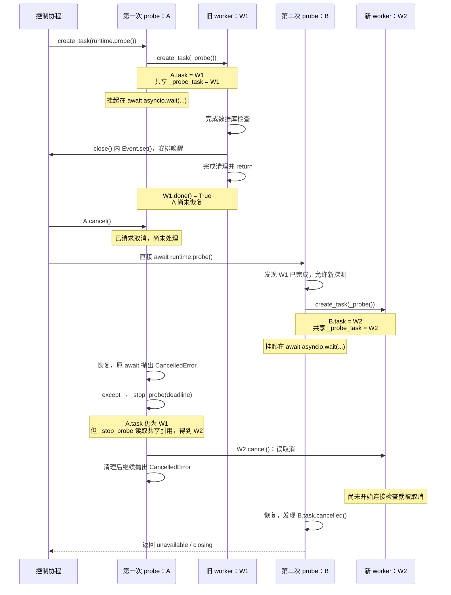

# 旧探测调用取消时误取消后继 worker

> **ID**：DB-010 · **日期**：2026-09-23 · **状态**：已修复 · **优先级**：P2
> **发现来源**：工作区代码审查及真实 asyncio 调度复现；DB-F02 开发阶段，未据此认定线上已发生。
> **范围**：`DatabaseRuntime._run_probe()`、`_stop_probe()` 与探测驱动的清理所有权。

## 现象与影响

旧探测 worker 已经完成，但调用它的外层 `probe()` 尚未返回。此时取消旧调用，再直接进入新 `probe()`，新调用可以创建后继 worker。旧调用随后处理取消，却从共享 `_probe_task` 读取到了后继 worker，将它取消。新探测尚未开始连接检查，就错误返回 `unavailable / closing`；运行时并未真正执行 `dispose()`。

这不是两个探测 worker 同时执行数据库操作，而是旧调用的取消收尾晚于新 worker 的登记。问题来自清理目标身份丢失，不需要数据库连接失败才能触发。

## 参与者与完整错误时序

| 名称 | 含义 |
| --- | --- |
| C | 控制协程，安排第一次调用、取消及第二次调用 |
| A | 第一次 `probe()` 的外层 Task |
| W1 | A 创建的内部 `_probe()` worker Task |
| B | C 直接 `await runtime.probe()` 的第二次调用过程；不是另外创建的 Task |
| W2 | B 创建的内部 `_probe()` worker Task |

下图区分两次外层调用。图中的 `A.task` / `B.task` 指各自 `_run_probe()` 栈帧的局部变量 `task`，不是 Task 对象的属性。



1. A 在 `_run_probe()` 创建 W1，并挂起在 `await asyncio.wait({task, cleanup_signal}, ...)`。A 的局部 `task` 和共享 `_probe_task` 都指向 W1。
2. W1 完成 SQL 检查及 `finally` 中的连接关闭，然后执行 `_probe()` 最后的 `return`。此时 `W1.done()` 为 `True`，不是仅仅“SQL 已执行完”或“开始清理”。
3. W1 完成只会安排等待者后续恢复，不会立即把 A 执行到返回。复现中 C 先获得执行机会；A 仍在原 `await asyncio.wait(...)` 挂起，尚未执行后面的结果判断。
4. C 调用 `A.cancel()`。取消请求已经提出，但 A 的异常处理尚未执行。C 紧接着直接 `await runtime.probe()` 进入 B，没有在两者之间再让出执行权。
5. B 发现共享引用所指 W1 已完成，收取结果并清空引用，随后创建 W2，将共享 `_probe_task` 改为 W2。B 在自己的 `asyncio.wait()` 处挂起。
6. A 恢复时，原先的 `await` 抛出 `CancelledError`。A 的局部 `task` 仍是 W1，但旧 `_stop_probe(deadline)` 重新读取共享 `_probe_task`，得到 W2，并取消 W2。
7. B 恢复后发现自己的 W2 已取消，返回 `("closing", None)`；外层 `probe()` 写成 `unavailable / closing`。A 完成收尾后继续向上抛出 `CancelledError`。

如果 A 在 B 创建 W2 **之前**就处理了取消，`_stop_probe()` 读到的仍是 W1，不会触发本次误取消。先调用 `cancel()` 与先完成取消处理不是同一件事。

## 旧代码关键分支

以下是修复前代码的关键片段，省略无关预算和清理细节，用于解释历史根因；不是独立可执行程序，也不是当前实现副本。当前代码见 [`DatabaseRuntime`](../../../app/infrastructure/database.py)。

```python
# A 和 B 都经过此入口：已完成 worker 不阻止后继探测。
if self._probe_task is not None:
    if not self._probe_task.done():
        return "starting", None
    if not self._probe_task.cancelled():
        self._probe_task.result()
    self._probe_task = None

task = self._probe_task = asyncio.create_task(self._probe(full, work_deadline))
cleanup_signal = asyncio.create_task(self._cleanup_started.wait())
try:
    await asyncio.wait(
        {task, cleanup_signal},
        timeout=max(0, work_deadline - loop.time()),
        return_when=asyncio.FIRST_COMPLETED,
    )
    # ... 正常结果判断 ...
except asyncio.CancelledError:
    if full and self._status.state not in {"closing", "closed"}:
        self._status = DatabaseStatus("unavailable", "starting")
    await self._stop_probe(deadline)  # 未传递本次的局部 task。
    raise
```

```python
# 旧清理实现：调用者身份没有保留，读取时共享引用可能已经换代。
async def _stop_probe(self, deadline):
    task = self._probe_task  # A 进入此处时读到 B 的 W2。
    if task is None:
        return True
    self._probe_stopped = True
    if not task.done():
        task.cancel()       # 误取消 W2。
        # ... 有界等待与驱动清理 ...
```

```python
# B 的正常结果判断，却接收到了 A 误取消 W2 的结果。
elif task.cancelled():
    return "closing", None

# 外层 probe() 将返回原因写入准入状态。
reason, version = result
self._status = DatabaseStatus("unavailable" if reason else "ready", reason, version)
```

发生误取消时的引用关系：

```text
A 的局部 task ─────────→ W1（已完成）
B 的局部 task ─────────→ W2（新建）
共享 self._probe_task ─→ W2

A 的取消收尾 → 重新读取共享引用 → 得到 W2 → 误取消
```

## 可执行复现

在项目根目录、已安装项目依赖的 Python 环境中执行下面代码。它直接使用真实 `DatabaseRuntime` 和 asyncio 调度，仅将引擎替换为最小模拟连接；没有运行 PostgreSQL、SQLAlchemy 池事件或网络 I/O。直接赋值私有 `_engine` 仅用于隔离该调度问题，不是应用初始化示例。使用默认非 eager Task 调度。

`first_closed.set()` 只安排唤醒 C，不立刻切换执行。模拟 `close()` 在设置 Event 后没有再挂起，W1 随后返回，因此 C 恢复时可以检查 `W1.done()`。**Event 本身不是 worker 完成的证明**；代码额外断言 W1 已完成而 A 尚未完成。

```python
import asyncio
from types import SimpleNamespace

from app.infrastructure.database import DatabaseRuntime, DatabaseTimeouts


async def main():
    first_closed = asyncio.Event()
    starts = 0

    async def start():
        nonlocal starts
        starts += 1

    async def noop(*args):
        pass

    async def scalar(*args):
        return 1

    async def close():
        if starts == 1:
            first_closed.set()
        # 此处不能再 await；W1 将连续执行到 _probe() 返回。

    connection = SimpleNamespace(
        start=start, begin=noop, execute=noop, scalar=scalar, close=close
    )
    runtime = DatabaseRuntime(
        url="postgresql+asyncpg://localhost/runtime_test",
        pool_size=1,
        max_overflow=0,
        echo=False,
        timeouts=DatabaseTimeouts(
            connect_timeout_seconds=1,
            pool_timeout_seconds=1,
            operation_timeout_seconds=1,
            probe_timeout_seconds=2,
            cleanup_timeout_seconds=0.5,
            shutdown_timeout_seconds=2,
        ),
        schema_check=noop,
    )
    runtime._engine = SimpleNamespace(connect=lambda: connection, dispose=noop)
    A = asyncio.create_task(runtime.probe())
    try:
        async with asyncio.timeout(5):
            await first_closed.wait()
            W1 = runtime._probe_task
            assert W1 is not None and W1.done() and not A.done()
            print("W1 done:", W1.done(), "A done:", A.done())

            A.cancel()
            B_result = await runtime.probe()  # B 直接在当前 Task 内执行。
            print("B:", B_result)
            print("connections started:", starts)

            try:
                await A
            except asyncio.CancelledError:
                print("A: CancelledError")
    finally:
        if not A.done():
            A.cancel()
        await asyncio.gather(A, return_exceptions=True)
        await runtime.dispose()


asyncio.run(main())
```

修复前的复现结果：

```text
W1 done: True A done: False
B: DatabaseStatus(state='unavailable', reason='closing', schema_version=None)
connections started: 1
A: CancelledError
```

修复后运行同一示例的实际结果：

```text
W1 done: True A done: False
B: DatabaseStatus(state='ready', reason=None, schema_version=1)
connections started: 2
A: CancelledError
```

## 根因、方案与取舍

根因是把“当前登记的探测”误当成“本次调用拥有的探测”。仅修正 `task.cancel()` 不足以完成隔离：共享停止标记、取消时的准入状态写入、驱动终止也必须遵守相同身份边界。

采用最小修复：`_stop_probe(task, deadline)` 显式接收调用者捕获的 worker；超时与取消路径传局部 `task`，关闭路径传关闭开始时捕获的 worker。只有该 worker 仍是当前 `_probe_task` 时，才改写当前探测的停止标记、读取它的共享清理截止信息、执行取消准入更新。驱动强制终止按显式 worker 身份匹配；`None` 不代表清理空闲驱动的授权。保留原有有界清理及取消传播，不增加锁、排队或新状态类，也不改变已完成 worker 允许后继探测的契约。

修复原则示意（完整实现以源码为准）：

```python
# _run_probe() 的取消路径
except asyncio.CancelledError:
    if full and self._probe_task is task and self._status.state not in {"closing", "closed"}:
        self._status = DatabaseStatus("unavailable", "starting")
    await self._stop_probe(task, deadline)
    raise

# _stop_probe() 不再重新选择清理目标
async def _stop_probe(self, task, deadline):
    if task is None:
        return True
    if self._probe_task is task:
        self._probe_stopped = True
    # ... 只取消、等待 task，驱动清理也传入同一个 task ...
```

工业级语义参照：Python 官方 [`Task.cancel()`](https://docs.python.org/3/library/asyncio-task.html#asyncio.Task.cancel) 说明取消请求在后续事件循环周期把 `CancelledError` 注入目标协程，并不等于调用时同步完成清理。官方[取消处理建议](https://docs.python.org/3/library/asyncio-task.html#task-cancellation)要求收尾后通常继续传播取消。本实现保留这一行为。`asyncio.wait()` 的输入任务有独立生命周期；取消等待方不应被当作它们已经完成清理的证据，运行时显式停止自己拥有的 worker，参见官方[等待原语](https://docs.python.org/3/library/asyncio-task.html#asyncio.wait)。

## 实施与验证

已修改 [`database.py`](../../../app/infrastructure/database.py) 的取消、停止及驱动清理路径；回归用例维护在 [`test_database.py`](../../../tests/unit/test_database.py)，不在文档复制测试实现。

| 回归用例 | 修复前证据 | 修复后验证内容 |
| --- | --- | --- |
| `test_cancelled_old_probe_does_not_cancel_successor`（旧调用参数化为 `probe` / `ping`） | 两条用例失败；后继探测遭取消 | A/B 各执行一次连接检查，计入预先 init 共三次；后继探测成功、旧调用仍传播 `CancelledError` |
| `test_old_probe_cleanup_does_not_terminate_successor_driver` | 在独立进程内加载 Git index 旧源码执行，新用例失败，未回退工作区文件 | 旧清理的等待返回被延后，待 W2 借出连接后才恢复旧 `finally`；旧清理不会终止 W2 的驱动 |

第三条覆盖同一根因的另一出口：旧 `_stop_probe()` 可以已经捕获 W1 并开始等待；等待期间 W1 完成、W2 登记并借出驱动。旧清理随后进入 `finally`，若驱动终止仍通过共享 `_probe_task` 寻找 Owner，就会把 W2 的驱动误终止。因此取消目标与驱动清理必须同时使用显式 worker 身份，不能只修 `task.cancel()`。

2026-09-23 本轮验证：

- 数据库相关测试：`tests/unit/test_database.py`、`tests/unit/test_database_lifecycle_review.py`、`tests/unit/test_database_settings.py` → **128 passed**。
- 全量 `pytest -q -p no:cacheprovider` → **1640 passed, 5 xfailed**（52.10s）；另有 1 条既有 Starlette 警告。
- Ruff 静态检查及格式检查通过；独立代码复核未发现可证实的新问题。
- 已提取本文可执行示例分别运行修复版和独立进程内加载的 Git index 旧版：新版本为 `ready`、2 次连接检查；旧版本为 `unavailable/closing`、1 次连接检查。两者均保留 A 的 `CancelledError`。对齐、相对链接目标及差异格式检查通过。

本问题的模拟复现只证明 asyncio 调度及运行时逻辑，不代替 DB-F06 的真实 PostgreSQL 成功路径、池事件及驱动终止验收。

## 教训与关联

可复用教训：异步调用的清理必须持有本次资源身份，不能在延迟取消时重新读取可被后继调用替换的共享引用。worker 完成与外层调用返回是两个时刻，测试应覆盖两者之间的窗口。

- [数据库组件说明](../../../docs/infrastructure_doc/database_doc/database.md)
- [DB-003：运行时资源所有权](2026-09-22-runtime-resource-ownership.md)
- [共享数据库基础设施决策](../../../adr/infrastructure/database/2026-09-22-shared-database-foundation.md)
- [数据库问题索引](README.md)
